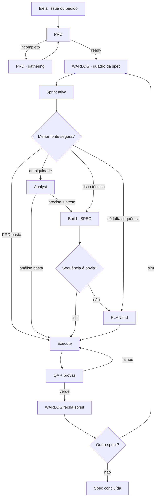

# Superflow v2 — menos metawork, mesma inteligência

> Data: 2026-07-15
>
> Atualizado: 2026-07-19 — primeira fatia IMPLEMENTADA no plugin: Discovery →
> modo do Analyst, multi-analyst com síntese única, `SPEC.md` default do Build,
> PRD gate `gathering` (script nunca promove) e task board com prova em browser
>
> Estado: parcialmente implementada — kernel de fases e task board já no
> plugin; WARLOG oficial, status v2, budgets v2 e `superflow:proof` seguem
> proposta
>
> Fonte: `nmarcofernandess/superflow`

## Veredito

Estamos mais perto de algo produtivo. A conversa encontrou a causa do problema:
o Superflow transformou flexibilidade em uma ontologia grande demais. Ele cria
vários estados e artefatos sobrepostos e depois gasta inteligência reconciliando
o próprio harness enquanto o produto é decidido em tempo real.

A simplificação central é:

> O `WARLOG.md` governa a spec inteira. O `status.json` aponta a sprint ativa, o
> artefato atual e a próxima ação. Analyst, Build e Plan só existem quando a
> sprint precisa deles. Nenhum artefato acompanha microtasks.

A proporcionalidade precisa continuar até o fechamento:

> O budget decide quanto entender e planejar antes da execução. O
> `proof_profile` decide quanto provar e conseguir repetir depois dela. HTML
> apresenta a evidência; não define sua força.

O risco de cavar outro buraco começa se tentarmos prever todas as combinações.
Esta proposta fixa um kernel pequeno e manda validá-lo em specs reais antes de
expandir.

## Evidência no plugin atual

1. `superflow_taskgen.py` tem 510 linhas e calcula maturidade/risco por quantidade
   de palavras e keywords. Esse score pode marcar
   `decision.prd_status = complete` mesmo quando o PRD gerado ainda diz “To be
   filled from repository inspection” e “No data contract identified yet”.
2. O estado humano se espalha por `PRD.md`, `status.json`, `progress.md`,
   `analysis.md`, `technical_blueprint.md`, dois formatos de Plan,
   `implementation_log.json`, `WARLOG.md` e `qa_report.md`.
3. O `status.json` v1 mantém nove fases, oito ponteiros de artefatos, scores,
   confidence, decision e task source. Ler o GPS virou uma tarefa.
4. O WARLOG oficial exige snapshot, decisões, eventos e próxima ação, mas perdeu
   WBS, dependências e divisão em sprints que o Warlog Minimal já faz melhor.
5. Os scripts Python somam 1.717 linhas e misturam mecânica determinística com
   julgamento semântico.

Python não é o problema. Dar a um script autoridade para julgar produto,
maturidade e completude é o problema.

## Decisões já convergentes

### 1. Discovery fica dentro do Analyst

Discovery não precisa ser fase pública. Bug desconhecido, recon, logs e ausência
de evidência são modos de trabalho do Analyst.

```text
Antes: Discovery -> Analyst
Depois: Analyst usa discovery/recon/grill conforme necessário
```

### 2. Podem existir vários Analysts; existe uma síntese ativa

Uma sprint pode ter análise de produto, código, dados e performance. Build lê
essas análises e, quando necessário, produz uma única SPEC canônica. A SPEC lista
as fontes consumidas; o status não tenta reconciliar cada análise.

### 3. Build fecha a SPEC técnica

- PRD: promessa, escopo, comportamento e aceite do produto.
- Analyst: remove ambiguidade e prova terreno.
- Build: sintetiza evidência e fecha contratos técnicos numa SPEC.
- Plan: ordena a execução quando ela não é óbvia.

O ponteiro no status deve se chamar `spec`. Durante migração,
`technical_blueprint.md` pode continuar válido; para sprint nova, o default
recomendado é `SPEC.md`.

### 4. A skill de PRD possui o gate de completude

O script pode criar o esqueleto. Só a skill que produziu/revisou o PRD pode
promovê-lo.

Estados recomendados do entregável:

- `gathering`: ainda reúne decisões ou evidências;
- `ready`: cumpre o contrato e pode alimentar a próxima etapa;
- `blocked`: depende de decisão/evidência externa;
- `superseded`: outra versão é canônica.

`gathering` substitui o verde falso de um arquivo estruturalmente preenchido,
mas semanticamente vazio.

### 5. WARLOG é macro; Plan é por sprint

WARLOG enxerga a campanha inteira: sprints, dependências, decisões, contratos de
verde, harness, bloqueios e próxima fatia. Ele não acompanha microtasks.

Plan descreve como executar a sprint ativa. Pode conter passos e TDD, mas não
status por passo.

### 6. Plan canônico deve ser Markdown

`PLAN.md` é legível por humano e agente. Ele guarda precondições, ordem,
arquivos/áreas, mudança esperada, TDD, validação e aceite. O tracking vivo já é
responsabilidade do status/WARLOG no nível certo.

### 7. Warlog Minimal vira o WARLOG oficial

Não manter duas skills nem fazer uma chamar a outra. A implementação correta é
refatorar:

- preservar missão, WBS, dependências, sprints, cronologia e próxima ação;
- adaptar PlantUML para Mermaid;
- substituir RFE por microtask por contrato macro da sprint;
- adicionar budget, gate humano, contrato de verde e fronteira do harness;
- depois de provar paridade, deprecar a skill antiga.

## Kernel v2



Toda sprint precisa apenas de:

1. resultado mergeável;
2. uma fonte ativa e madura;
3. contrato de verde;
4. próxima ação explícita.

## Sprint da spec

“Sprint” aqui é uma fatia mergeável da spec, normalmente um PR, não um período
Scrum.

O WARLOG descreve cada sprint assim:

```markdown
## S2 — Resultado humano verificável

- Estado: blocked | ready | active | qa | done
- Depende de: S1, decisão M3
- Budget: direct | plan | spec
- Rota: Analyst? -> Build? -> Plan? -> Execute -> QA
- Gate humano: decisão que muda a solução, ou none
- Contrato de verde: testes, prova visual, performance e regressões
- Harness: existente | ampliar aqui | sprint própria
- Artefatos: análises, SPEC, PLAN e QA que realmente existirem
- Próxima ação: uma ação concreta
```

Arquivos, TDD e passos vivem na SPEC/PLAN da sprint ativa, não no quadro macro.

## Budget por sprint

| Budget | Uso | Preparação esperada |
|---|---|---|
| `direct` | Fonte madura, mudança óbvia, baixo risco | Execute + QA |
| `plan` | Produto/técnica claros, mas há sequência | Plan + Execute + QA |
| `spec` | Ambiguidade, arquitetura, dados, performance ou múltiplas análises | Analyst conforme necessário + Build/SPEC + Plan quando necessário + Execute + QA |

O budget é proposto no WARLOG e o humano pode sobrescrevê-lo. Ele limita
metawork; não é score de keywords. Bug desconhecido usa `spec` com Analyst em
modo investigação — não precisa de fase Discovery nem budget “forensic”.

## Rolling wave

O todo é dividido cedo; o detalhe nasce tarde.

No início:

- PRD com resultado total;
- WARLOG com sprints, dependências e decisões conhecidas;
- primeira sprint desbloqueada.

Antes de cada sprint:

1. revalidar o sistema atual;
2. rodar Analyst só se faltar entendimento/evidência;
3. produzir Build/SPEC só se houver fechamento técnico;
4. produzir PLAN só se a execução não for óbvia;
5. executar, provar e fechar no WARLOG;
6. detalhar a próxima sprint somente depois.

Assim o plano da quarta PR não apodrece antes da primeira ser mergeada.

## Status v2

GPS mínimo recomendado:

```json
{
  "schema_version": "superflow.status.v2",
  "id": "069-medidas-caseiras-axioma",
  "state": "active",
  "active_sprint": "S2",
  "current": {
    "stage": "plan",
    "artifact": "sprints/S2/PLAN.md",
    "state": "gathering"
  },
  "source": {
    "kind": "spec",
    "path": "sprints/S2/SPEC.md"
  },
  "warlog": "WARLOG.md",
  "next_action": "Fechar o PLAN da S2 contra o contrato de verde.",
  "blocked_by": [],
  "updated_at": "2026-07-15T00:00:00Z"
}
```

Ele responde em menos de um minuto:

- qual sprint está ativa;
- qual artefato está sendo produzido;
- qual fonte madura deve ser lida;
- qual é a próxima ação;
- o que bloqueia.

Não guarda fases puladas, scores, microtasks, porcentagem nem histórico. Decisões
e eventos vivem no WARLOG; contratos na SPEC; passos no PLAN.

## Estrutura recomendada

```text
specs/NNN-slug/
├── PRD.md
├── WARLOG.md
├── status.json
└── sprints/
    ├── S1-slug/
    │   ├── ANALYSIS-*.md   # zero, um ou vários
    │   ├── SPEC.md         # somente se Build for necessário
    │   ├── PLAN.md         # somente se Plan for necessário
    │   └── QA.md
    └── S2-slug/
        └── ...
```

Não criar arquivo vazio para provar fase pulada.

## Artefatos redundantes

### `progress.md`

Remover do contrato canônico. Em trabalho longo, WARLOG já registra progresso
humano. Em trabalho curto, status, diff/PR e QA bastam.

### `implementation_log.json`

Remover do contrato canônico. Evidência útil fica em commits/diff, testes,
manifests, `QA.md` e evento macro no WARLOG.

### `QA.md`

Manter apenas como fechamento: critério de aceite -> evidência -> resultado.

## Harness

O WARLOG separa, mas não implementa, o harness:

- `existente`: sprint só usa a prova atual;
- `ampliar aqui`: pequena prova necessária ao comportamento;
- `sprint própria`: infraestrutura reutilizável/cara vira entrega separada.

O contrato de verde diz o que provar; PLAN diz como; QA confirma.

## Política dos scripts Python

### Manter

- scaffold, numeração e slug;
- validator estrutural e de links;
- migração `status.v1 -> status.v2`;
- comando read-only que imprime sprint, fonte e próxima ação;
- fixtures estruturais do plugin.

### Remover como autoridade

- maturity/risk score por keywords;
- rota automática obrigatória;
- promoção automática de PRD;
- conteúdo genérico para satisfazer headings;
- auditoria semântica por regex;
- testes que apenas congelam heurísticas atuais.

Regra:

> Script valida forma e executa mecânica. Skill julga conteúdo. Humano decide
> produto.

## Como impedir a deturpação das skills

1. Cada fase exportada é a skill canônica completa, não um resumo no router.
2. O router só lê status/WARLOG, escolhe a próxima skill e para.
3. O router não reimplementa Analyst, Build, Plan, Warlog ou QA.
4. Skill forte incorporada vira fonte única; não ganha wrapper paralelo.
5. Fixtures de paridade rodam a skill direta e via Superflow sobre a mesma
   entrada e comparam evidência/decisões, não tamanho do texto.
6. Só o protocolo da fase ativa é carregado.

Economizar tokens resumindo a inteligência da fase é fracasso. A economia deve
vir de não carregar nem reconciliar fases que a sprint não usa.

## Casos que validam o desenho

### Export 055

O PRD raiz foi corretamente dividido em PR1–PR4. O plano global tentou carregar
quatro fases e quinze subtasks. Depois dos merges, PR3 precisou de análise e Plan
próprios; o próprio `PLAN-PR3-COPY.md` supersede partes do blueprint/plano da era
PR1.

No v2:

```text
PRD raiz -> WARLOG PR1/PR2/PR3/PR4
status -> apenas PR ativa
PR3 -> análises -> SPEC consolidada -> PLAN próprio -> QA
PR4 -> detalhe somente após PR3 verde e dev revalidado
```

### Medidas Caseiras 069

O WARLOG já enxerga S1, S5 e S2, dependências e contratos de verde. O gap aparece
quando S2 complexa entra em execução sem SPEC/PLAN próprios e TDD, migração,
performance e prova precisam ser decididos em tempo real.

No v2, S1 pode ser `direct`/`plan`; S5 recebe plano próprio; S2 usa `spec`, com
análises necessárias, uma síntese e um Plan Markdown antes de executar.

## Migração mínima

1. Revisar este memo e cravar as decisões abertas abaixo.
2. Refatorar Warlog Minimal no WARLOG oficial; provar paridade; eliminar o duplo.
3. Criar `status.v2` mínimo e mover Discovery para Analyst.
   (✅ Discovery → modo `investigation` do Analyst FEITO 2026-07-19, ainda
   sobre o status v1; status.v2 pendente.)
4. Fazer a skill de PRD possuir `gathering -> ready|blocked|superseded`.
   (✅ FEITO 2026-07-19: script sempre grava `gathering`; promoção é ato da
   skill; forward_test guarda o invariante invertido.)
5. Tornar Build a SPEC consolidada por sprint.
   (✅ Artefato `SPEC.md` + síntese multi-analyst FEITOS 2026-07-19; o "por
   sprint" depende do modelo de sprint do WARLOG, pendente.)
6. Tornar `PLAN.md` canônico e sem tracking.
7. Remover `progress.md` e `implementation_log.json` do contrato.
8. Cortar scripts até sobrar mecânica.
9. Validar com três fixtures: simples, 069 e Export 055.
10. Introduzir a taxonomia de prova e o `proof_profile` nos contratos de
    Build/Plan/QA.
11. Criar `superflow:proof` primeiro como inteligência de seleção e
    orquestração do harness nativo; só depois avaliar scaffold portátil de
    atlas.
12. Validar os três níveis com um caso de fotografia, uma jornada com estados
    positivos e negativos e um atlas regenerável real.
13. Criar `assets/task-board/` (`board.html` + `board-data.example.js`) e
    cravar a atualização do board no boundary do Execute; validar numa spec
    real antes de acoplar a qualquer script.
    (✅ FEITO 2026-07-19: template + exemplo no plugin, contratos em
    plan/execute/qa, prova headless com asserts DOM e screenshot; falta só o
    uso numa spec real.)

Migração de specs antigas deve ser lazy: só quando uma spec for retomada.

## Testes de sucesso

- Retomada: agente novo entende sprint/fonte/próxima ação em menos de um minuto.
- Fidelidade: Analyst/Warlog direto e via Superflow mantêm o mesmo nível de
  evidência e decisão.
- Metawork: durante execução, só status no boundary, WARLOG no macro e QA no
  fechamento precisam de atualização.
- Rolling wave: próxima sprint recebe detalhe novo sem reconciliar planos
  futuros obsoletos.
- Controle humano: decisão nova de produto aparece como gate; nenhum script a
  resolve.
- Adequação da prova: o nível escolhido é proporcional ao risco e à necessidade
  de repetição, sem transformar todo ajuste visual em campanha E2E.
- Honestidade da evidência: afirmação, cenário, comando, resultado e artefato
  permanecem ligados; screenshot órfão ou HTML manual não produz verde.
- Regeneração: quando o contrato exigir atlas, o mesmo comando reproduz
  manifest, resultados, imagens e HTML sem edição manual.

---

## Mindset — O plano deve pré-compilar o TDD até o DoD

Percebi que um plano não pode apenas decompor “o que implementar”. Ele precisa pré-compilar como cada comportamento será provado até o Definition of Done.

Quando o TDD é imaginado durante a execução, cada agente interpreta o requisito novamente, inventa testes diferentes e depende dos reviewers para descobrir contratos que já deveriam estar explícitos. Isso gera retrabalho, expansão tardia de escopo e ciclos intermináveis de “implementa → reviewer encontra furo → cria teste → corrige”.

A unidade correta de planejamento não é uma atividade técnica. É um comportamento completo, com seu próprio ciclo de prova:

1. contrato de comportamento;
2. teste exato que deve falhar;
3. motivo esperado da falha;
4. implementação mínima;
5. teste passando;
6. casos negativos e concorrentes;
7. integração com os consumidores;
8. evidência necessária para o DoD;
9. commit/review independente.

Portanto, cada task do Superflow deve nascer no formato `writing-plans`, contendo:

- arquivos exatos de implementação e teste;
- interfaces consumidas e produzidas;
- nomes e conteúdo dos testes;
- comando para provar o RED;
- implementação prevista;
- comando para provar o GREEN;
- contratos positivos, negativos, de erro e concorrência;
- paridade entre superfícies equivalentes;
- prova visual/E2E quando o comportamento for de jornada;
- gate final e evidência exigida.

O plano também precisa terminar com uma matriz de cobertura do DoD:

```text
requisito da spec
→ task responsável
→ teste unitário
→ teste de integração
→ E2E/prova visual
→ gate de CI
→ documento atualizado
```

Nenhum requisito pode ficar coberto apenas por prosa, “review posterior” ou esperança de que o executor perceba.

### Mudança de papel dos reviewers

Reviewer não deve funcionar como autor tardio do plano. Sua função é encontrar o imprevisível: erro de implementação, interação emergente, risco não modelado ou premissa falsa.

Se o reviewer encontra repetidamente contratos fundamentais ausentes — atomicidade, idempotência, conflito, autorização, paridade, estado vazio — isso indica falha do plano, não apenas falha do código.

### Regra operacional

> Nenhuma task entra em execução sem declarar previamente seus contratos positivos, negativos, concorrentes e de integração, com teste, comando e resultado esperado. Nenhuma fatia termina sem mapear suas provas ao DoD global.

Testes adicionais durante a execução continuam permitidos para descobertas genuínas. O que não pode acontecer é usar a execução para descobrir o TDD básico que o plano deveria ter definido.

### Síntese

O plano não é uma lista de coisas para codar.

O plano é um programa de execução e verificação: já determina o que será construído, como sabemos que falhou antes, como sabemos que passou depois e como cada verde local compõe o DoD final.

---

## Insight — O Superflow precisa escolher a profundidade da prova

Existe um buraco real no desenho atual. O Superflow já consegue decidir quanto
pensamento uma sprint exige antes da execução — `direct`, `plan` ou `spec` — e
já sabe produzir um HTML didático para explicar uma solução. Ele ainda não sabe
decidir qual espécie de prova o resultado exige depois da execução.

A confusão que revelou o problema foi tratar HTML, screenshot, E2E e atlas como
se fossem alternativas equivalentes. Não são. Eles ocupam camadas diferentes:

> HTML é formato de apresentação. Não é nível de garantia.

Um HTML pode explicar uma fotografia manual, resumir uma jornada automatizada
ou ser a visualização gerada de um atlas inteiro. A aparência final pode ser
parecida enquanto a força da evidência muda radicalmente. Sem essa distinção, o
Superflow corre o risco de entregar um mural convincente quando o pedido era
provar comportamento, ou de construir infraestrutura regenerável quando o
trabalho só precisava de três imagens honestas.

### Os três níveis de prova

| Nível | Pergunta respondida | Mecanismo principal | Papel do HTML |
|---|---|---|---|
| `snapshot` — fotografia | “Como ficou visualmente?” | Navegação real, estado conhecido e screenshots | Expor e explicar as imagens |
| `journey` — jornada comportamental | “O fluxo realmente funciona?” | E2E ou miniapp com asserts, incluindo estados positivos e negativos | Opcional; resumir execução, passos e resultados |
| `atlas` — prova regenerável | “Conseguimos repetir, auditar e detectar regressão no futuro?” | Cenários tipados, fixtures, helpers, PNG/JSON, manifest, validator e renderer | Gerado automaticamente; nunca editado à mão |

O nome `journey` é deliberado. E2E costuma ser o mecanismo, mas o produto da
prova é a jornada comportamental. Ela pode ser executada por Playwright, outro
runner, uma miniaplicação controlada ou um harness nativo do projeto. Amarrar o
conceito à ferramenta faria o Superflow confundir intenção com implementação.

Exemplo concreto:

```text
Fotografia:
abri o modal no estado correto e tirei um print válido

Jornada:
criei a medida → selecionei → salvei → reabri → editei
→ apareceu o lock → resolvi → o estado ficou limpo

Atlas:
um comando executa essa jornada e suas variações
→ valida cada cenário
→ gera resultado estruturado + screenshots
→ rejeita artefato inválido ou ausente
→ monta o HTML a partir do manifest
→ pode ser regenerado e comparado daqui a seis meses
```

### A situação atual do plugin

O `superflow:html-didatico` já contém uma boa solução editorial, especialmente
na Direção C:

- tese e explicação de um lado;
- evidência visual do outro;
- comando e critério de aceite;
- slots preparados para receber artefatos reais depois.

Isso resolve apresentação. O preenchimento, porém, ainda é manual e não carrega
um contrato de execução. A skill não possui:

- catálogo de cenários;
- schema de artefatos;
- manifest que ligue afirmação, execução e evidência;
- validação de screenshots e resultados;
- garantia de que o comando terminou verde;
- regeneração determinística;
- detecção de screenshots órfãos ou cenários prometidos que desapareceram;
- vínculo formal entre teste, imagem e afirmação editorial.

A skill de QA menciona browser, screenshot, E2E e prova visual, mas não escolhe
profundidade nem diferencia fotografia, jornada e atlas. Portanto, duas tarefas
com riscos completamente diferentes podem terminar com o mesmo rótulo genérico
de “prova visual”.

Ao mesmo tempo, o próprio v2 já contém as sementes corretas:

```text
Harness:
- existente
- ampliar aqui
- sprint própria
```

E o mindset de planejamento TDD → DoD já exige a cadeia:

```text
requisito
→ task responsável
→ teste unitário
→ teste de integração
→ E2E/prova visual
→ gate de CI
→ documento atualizado
```

O novo insight não pede outro workflow paralelo. Ele dá semântica ao campo de
prova que já existe: define quanto provar, como declarar essa decisão e quando a
evidência precisa sobreviver como infraestrutura regenerável.

### A referência concreta já existe no DietFlow

Não existe hoje uma skill genérica instalada que faça essa seleção e entregue
os três níveis. Existem peças separadas:

- `html-didatico`: apresentação manual e linguagem editorial;
- `superflow:qa`: fechamento e coleta de evidência, ainda sem taxonomia;
- `dietflow-ci`: conhecimento repo-specific da infraestrutura DietFlow;
- Proof Packs e atlas do DietFlow: implementação real do nível `atlas`.

O DietFlow já executa o pipeline avançado:

```text
flow E2E
→ metadata estruturada
→ manifest validado
→ sincronização de screenshots
→ renderer
→ index.html determinístico
→ mural de packs
```

Esse motor também recusa falso-verde: o teste terminal precisa ter passado, a
imagem prometida precisa existir, cenário declarado não pode desaparecer e o
HTML não é fonte editável de verdade. O atlas clinical-readonly mostra a versão
matricial especializada; Export mostra uma solução histórica e bespoke;
Receitas/Medidas mostra por que máquinas de estado pedem jornada antes de mural;
e Acompanhamento S1 mostra um uso legítimo de fotografia explicada.

A capacidade, portanto, existe no ecossistema. O que falta é extrair a
inteligência portátil sem copiar cegamente scripts, fixtures e pressupostos do
DietFlow para todo repositório.

### Nova capacidade: `superflow:proof`

Essa responsabilidade não deve ser engolida por `html-didatico`. Fazer isso
transformaria uma skill editorial forte num monstro encarregado de navegador,
Playwright, fixtures, CI, manifests, validação e rendering. A fronteira correta
é uma capacidade própria:

```text
superflow:proof
```

Responsabilidades:

1. interpretar a intenção de prova;
2. escolher e justificar o nível proporcional;
3. descobrir o harness existente no projeto;
4. reutilizar o harness nativo antes de criar infraestrutura;
5. definir cenários e contrato de evidência;
6. executar ou orientar a captura conforme o nível;
7. validar a ligação entre comando, resultado e artefato;
8. delegar linguagem visual e explicação ao `html-didatico`;
9. no nível `atlas`, gerar o HTML por manifest e renderer.

O modo explícito e o default automático podem coexistir:

```text
proof_mode: auto | snapshot | journey | atlas
```

Frases naturais devem mapear intenção, não tecnologia:

```text
“só quero prints”
→ snapshot

“prove que o fluxo funciona”
→ journey

“quero algo periódico, regenerável ou um atlas”
→ atlas
```

No modo `auto`, a seleção precisa considerar:

- quantidade e relevância dos estados;
- presença de save/reopen e persistência;
- loading, erro e dirty state;
- permissões, autorização e ações proibidas;
- concorrência, conflito e idempotência;
- casos em que algo não deve acontecer;
- múltiplas superfícies que prometem paridade;
- impacto em fundações compartilhadas;
- necessidade de repetição, auditoria ou comparação futura.

### Contrato mínimo de prova

Build ou Plan declara a necessidade; QA confirma o cumprimento. O perfil deve
ser pequeno o suficiente para não virar outra ontologia:

```yaml
level: snapshot | journey | atlas
reason: por que este nível é proporcional
command: como executar ou regenerar
scenarios: quais comportamentos e estados precisam ser provados
artifacts: quais resultados, imagens, manifests ou páginas serão produzidos
freshness: quando a evidência precisa ser regenerada
required_for_done: true | false
```

Esse perfil não acompanha microtasks. Ele pertence ao contrato de verde da
sprint e liga o planejamento ao fechamento. Se `required_for_done` for `true`,
QA não pode substituir a prova por prosa ou por um screenshot sem procedência.

### Encaixe no workflow

```text
Router
└── reconhece um pedido explícito de prova

Build/Plan
└── declara proof profile no contrato de verde

Execute
└── produz comportamento e prepara os estados necessários

QA
└── confirma o nível e aciona a prova
    ├── snapshot
    ├── journey
    └── atlas

superflow:proof
├── descobre e reutiliza o harness nativo
├── executa/captura evidências
├── valida artefatos
└── chama o renderer apropriado

html-didatico
└── cuida da narrativa, hierarquia visual e explicação
```

O Router só precisa reconhecer intenção explícita e encaminhar. Ele não deve
reimplementar a escolha, os cenários ou a validação. Plan não vira runner; QA
não vira renderer; `html-didatico` não vira framework E2E.

### Reuso antes de infraestrutura

A regra portátil deve ser:

```text
1. Existe harness/proof engine no projeto?
   → usar o nativo.

2. Não existe, mas a prova é fotografia?
   → navegar, capturar screenshots válidos e montar apresentação simples.

3. Não existe e a prova é uma jornada pontual?
   → usar o menor runner capaz de declarar passos e asserts honestos.

4. Não existe e a prova precisa ser recorrente ou auditável?
   → oferecer/scaffoldar o Proof Pack portátil.
```

O Superflow não deve obrigar todo projeto a instalar Playwright, copiar o motor
do DietFlow ou criar um atlas para mudança de baixa complexidade. Da mesma
forma, não pode aceitar fotografia como substituta de jornada quando a promessa
depende de persistência, conflito, autorização ou estados negativos.

### Assets portáteis e estudos de caso

O plugin não deve carregar dezenas de megabytes do DietFlow. Deve ensinar a
forma mínima com exemplos pequenos:

```text
assets/proof-examples/
├── snapshot/
│   ├── screenshot.png
│   ├── result.json
│   └── acompanhamento.html
├── journey/
│   ├── scenarios.ts
│   ├── journey.spec.ts
│   └── result.json
└── atlas/
    ├── pack.config.json
    ├── manifest.json
    ├── screenshots/
    ├── index.html
    └── minimal-renderer/
```

Estudos de caso documentados:

- Proof Packs genéricos do DietFlow como referência principal de `atlas`;
- clinical-readonly como campanha matricial especializada;
- Export como exemplo bespoke e argumento para padronização;
- Receitas/Medidas como máquina de estados que exige `journey`;
- Acompanhamento S1 como `snapshot` explicado e suficiente.

O anti-exemplo também deve ser explícito:

> HTML bonito com prints antigos, sem comando, sem commit, sem resultado
> estruturado e sem garantia de que o cenário passou.

Ele mostra a falha melhor que uma abstração: apresentação sem cadeia de
procedência é comunicação, não prova.

### Guardrails contra nova burocracia

- Nem toda sprint precisa de HTML.
- Nem toda mudança visual precisa de E2E.
- Nem toda jornada precisa virar atlas.
- `atlas` só é proporcional quando repetição, auditoria, matriz de cenários ou
  regressão futura justificam o custo.
- Screenshot sem estado, comando e resultado não prova comportamento.
- HTML gerado nunca vira fonte de verdade editada manualmente.
- Evidência não pode sobreviver desconectada do commit e do cenário que a
  produziu.
- O harness nativo do projeto tem precedência sobre scaffold genérico.
- Descoberta genuína durante execução pode ampliar a prova, mas QA não deve
  inventar tardiamente o nível básico que Plan deveria ter declarado.

### Por que isso importa para o v2

O problema é simétrico ao que motivou o budget por sprint. Antes, o Superflow
forçava ou pulava fases sem uma boa medida de quanto pensar. Sem a taxonomia de
prova, ele também pode provar de menos ou construir demais.

Assim, o v2 precisa responder duas perguntas proporcionais:

```text
Antes de executar:
quanto precisamos entender e planejar?

Depois de executar:
quanto precisamos provar e conseguir repetir?
```

Essa evolução fecha uma deficiência central: um sistema que roteia bem a
preparação, mas trata toda evidência como “screenshot/E2E”, ainda não governa o
Definition of Done inteiro.

A formulação essencial é:

> Fotografia prova aparência. Jornada prova comportamento. Atlas prova
> comportamento repetível e auditável.

---

## Insight — A sprint precisa de um painel de tasks que o humano enxerga

O sintoma que revelou o buraco: durante a execução, a IA frequentemente
esquece de manter as tasks — e o humano fica sem saber onde o trabalho está.
Não é falta de artefato. `status.json`, `PLAN.md` e WARLOG existem, mas são
interfaces agente-agente: o humano não vai abrir JSON nem parsear Markdown
para descobrir se a task 3 de 7 terminou. E o HTML de acompanhamento
(`html-didatico`) não cobre esse papel: ele é narrativa pontual — explica uma
solução ou fecha uma entrega — e apodrece no instante em que a execução
avança um passo.

> O plano precisa de um local explícito que o humano possa ver. Não importa
> qual HTML de acompanhamento exista na spec: as tasks da sprint ativa
> merecem uma superfície própria, viva, separada da narrativa.

### O que o mapa do 076 provou

A referência concreta é o `MAPA-DO-CAMINHO-076.html` (spec de ontologia de
alimentos do DietFlow): uma linha de metrô vertical com estações `done`,
`aqui` (pulsando, "VOCÊ ESTÁ AQUI") e futuras, cada estação com nome e uma
linha dizendo **o que ela entrega**. Em um scroll o humano entende passado,
presente e futuro da sprint.

O que ele acertou:

- estados visuais imediatos (feito / aqui / futuro), sem legenda;
- cada estação descreve resultado ("CLI dry-run com gates verdes"), não
  atividade ("implementar CLI");
- uma página, zero seções supérfluas.

O que ele errou: é artesanal. Dados entrelaçados no markup — atualizar o
estado de uma task custa reescrever HTML. Quando atualizar custa caro,
ninguém atualiza, e o painel mente. É a mesma lição do falso-verde: artefato
que não acompanha a realidade é pior que artefato nenhum.

### Separar template de dados

A correção é a mesma que separa renderer de manifest no nível `atlas`:

```text
board.html       → layout congelado. Nunca editado por spec.
board-data.js    → uma constante. Única coisa que a IA toca.
```

O detalhe técnico que destrava a "auto-atualização" barata: `<script
src="board-data.js">` clássico **funciona em `file://`** — diferente de
`fetch` e de ES modules, que o browser bloqueia por CORS fora de um servidor.
Então o `board.html` renderiza a constante em runtime, o humano deixa a aba
aberta e dá refresh, e a IA nunca gasta token com markup. Atualizar o painel
é reescrever um arquivo de ~30 linhas — um `Write` pequeno e à prova de erro
de edição, não um `Edit` cirúrgico dentro de um HTML de 300 linhas.

### Modelo de dados mínimo

```js
const BOARD = {
  spec: "076-ontologia-alimentos",
  sprint: "E1 — apply seco + fusão",
  updated: "2026-07-19 14:30",
  next: "Rodar o apply real depois do gate verde",
  tasks: [
    { name: "Decisões congeladas",  delivers: "10 decisões com lineage em decisions/marco-f1.json", state: "done" },
    { name: "CLI apply-decisions",  delivers: "dry-run com gates de identidade e precedência",      state: "done" },
    { name: "Fusões par-a-par",     delivers: "65 colisões julgadas com evidência",                 state: "active" },
    { name: "Pitstop — gate rejeitou", delivers: "decisão sobre precedência C>B>A revisada",        state: "added" },
    { name: "Preview final",        delivers: "732 conceitos, 0 pendências, exit 0",                state: "queued" },
  ],
};
```

Cinco estados e nada mais: `done`, `active`, `queued`, `blocked` e `added` —
o último para pitstops, conversas e descobertas inseridas no meio da corrida,
que hoje somem porque não têm onde existir. `delivers` é obrigatório: é o que
torna o painel explicativo (o que esta task entrega) em vez de um checklist
de atividades. Campo extra é ontologia nova; se a constante ficar grande, o
problema é sprint mal fatiada, não schema pequeno.

### Contrato de atualização — piggyback, não ritual novo

O board não cria um boundary novo; ele pega carona no que já existe:

- **Plan** (ou Execute na primeira task, quando Plan não existir) cria o
  board: copia o template para a sprint e escreve o primeiro `board-data.js`
  a partir das tasks do `PLAN.md`.
- **Execute** atualiza `board-data.js` no MESMO boundary em que já atualiza o
  `status.json`: terminou task, inseriu pitstop, bloqueou. Se o status mudou
  e o board não, o boundary não terminou.
- **QA** marca o fechamento da última estação.

O board é projeção, nunca fonte. `PLAN.md`, `status.json` e WARLOG continuam
canônicos; divergência se resolve regenerando o board a partir deles — nunca
o contrário.

### Por que isso conserta o esquecimento

A IA esquece de manter tasks porque hoje elas vivem em artefatos que ninguém
abre — custo de manutenção sem feedback de ninguém olhando. Um painel que o
humano de fato olha inverte o incentivo em dois sentidos: o custo de manter
caiu para um `Write` de 30 linhas, e a cobrança ficou natural — "o board diz
que você está na task 2, mas você acabou de dizer que terminou a 4". A
superfície visível é o mecanismo de enforcement, não mais uma obrigação.

### Fronteiras com as outras superfícies

| Superfície | Papel | Pergunta que responde |
|---|---|---|
| Task board | posição | "Onde a execução está agora?" |
| `superflow:proof` | evidência | "O comportamento foi provado?" |
| `html-didatico` | explicação | "Como esta solução funciona?" |
| WARLOG | campanha | "Como as sprints se encadeiam?" |

Não misturar: o board não vira mural de prova, não ganha narrativa editorial
e não duplica o quadro macro do WARLOG. Escopo do board é a sprint ativa.

### Onde mora no plugin

```text
assets/task-board/
├── board.html             # template congelado — linha de metrô, 5 estados,
│                          #   "você está aqui", lê BOARD de board-data.js
└── board-data.example.js  # constante de exemplo que documenta o schema
```

E na spec, por sprint:

```text
specs/NNN-slug/sprints/SX-slug/
├── board.html         # cópia do template (autocontido, sobrevive ao plugin)
└── board-data.js      # o único arquivo que a execução reescreve
```

Duplicar o template por sprint é deliberado: o artefato fica autocontido no
repo da spec e uma evolução futura do template não reescreve a história das
sprints já fechadas.

### Guardrails

- Sprint `direct` trivial não precisa de board — dois passos não merecem
  painel.
- `board.html` da spec nunca é editado; melhoria de layout acontece no
  template do plugin e vale para sprints futuras.
- O board não substitui `status.json` como GPS do agente — agente lê status,
  humano olha board.
- Task sem `delivers` honesto é atividade disfarçada; reescrever antes de
  entrar no painel.
- Board desatualizado descoberto em QA é falha de boundary do Execute, com o
  mesmo peso de um `status.json` estragado.

---

## Decisões ainda a cravar

Defaults recomendados:

1. ✅ CRAVADO E IMPLEMENTADO (2026-07-19): Build artifact `SPEC.md`;
   `technical_blueprint.md` segue válido como nome legado (migração lazy).
2. Unidade: `sprint da spec`, definida como fatia mergeável.
3. Budgets: `direct`, `plan`, `spec`.
4. `progress.md`: remover sem fallback paralelo.
5. `implementation_log.json`: remover.
6. Migração v1: lazy.
7. Taxonomia de prova: `snapshot`, `journey`, `atlas`.
8. Nova capacidade: `superflow:proof`, separada de `html-didatico`.
9. `html-didatico`: apresentação e narrativa, nunca autoridade de execução.
10. Atlas portátil: scaffold somente quando não houver harness nativo e a
    recorrência justificar o custo.
11. ✅ CRAVADO E IMPLEMENTADO (2026-07-19): task board — `board.html`
    congelado + `board-data.js` único mutável, estados
    `done|active|queued|blocked|added`, `delivers` obrigatório; template em
    `assets/task-board/`, provado em browser via `file://`.
12. ✅ CRAVADO E IMPLEMENTADO (2026-07-19): dono da atualização do board —
    Execute no mesmo boundary do `status.json`; Plan cria, QA fecha; board é
    projeção, nunca fonte. Contratos gravados nas skills plan/execute/qa.

## Próximo passo

Não implementar a v2 inteira de uma vez. Primeiro, cravar as seis decisões do
kernel original e refatorar somente o WARLOG com fixtures de paridade. Se esse
corte não reduzir leitura e reconciliação numa spec real, corrigir o desenho
antes de tocar PRD/status/scripts.

O insight de prova não muda essa primeira fatia. Depois de validar o kernel e o
WARLOG, o próximo corte deve introduzir taxonomia e `proof_profile` nos
contratos antes de construir renderer ou scaffold. A inteligência de seleção
precisa provar valor antes de ganhar infraestrutura própria.

Isso protege o objetivo real: um Superflow que usa as skills fortes no momento
certo, sem gastar a janela de contexto organizando a própria burocracia.
