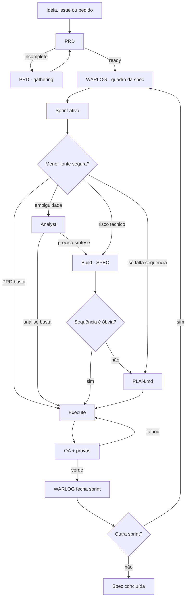

# Superflow v2 — menos metawork, mesma inteligência

> Data: 2026-07-15
>
> Estado: proposta de refatoração, ainda não implementada
>
> Fonte: `nmarcofernandess/superflow`

## Veredito

Estamos mais perto de algo produtivo. A conversa encontrou a causa do problema:
o Superflow transformou flexibilidade em uma ontologia grande demais. Ele cria
vários estados e artefatos sobrepostos e depois gasta inteligência reconciliando
o próprio harness enquanto o produto é decidido em tempo real.

A simplificação central é:

> O `WARLOG.md` governa a spec inteira. O `status.json` aponta a sprint ativa, o
> artefato atual e a próxima ação. Analyst, Build e Plan só existem quando a
> sprint precisa deles. Nenhum artefato acompanha microtasks.

O risco de cavar outro buraco começa se tentarmos prever todas as combinações.
Esta proposta fixa um kernel pequeno e manda validá-lo em specs reais antes de
expandir.

## Evidência no plugin atual

1. `superflow_taskgen.py` tem 510 linhas e calcula maturidade/risco por quantidade
   de palavras e keywords. Esse score pode marcar
   `decision.prd_status = complete` mesmo quando o PRD gerado ainda diz “To be
   filled from repository inspection” e “No data contract identified yet”.
2. O estado humano se espalha por `PRD.md`, `status.json`, `progress.md`,
   `analysis.md`, `technical_blueprint.md`, dois formatos de Plan,
   `implementation_log.json`, `WARLOG.md` e `qa_report.md`.
3. O `status.json` v1 mantém nove fases, oito ponteiros de artefatos, scores,
   confidence, decision e task source. Ler o GPS virou uma tarefa.
4. O WARLOG oficial exige snapshot, decisões, eventos e próxima ação, mas perdeu
   WBS, dependências e divisão em sprints que o Warlog Minimal já faz melhor.
5. Os scripts Python somam 1.717 linhas e misturam mecânica determinística com
   julgamento semântico.

Python não é o problema. Dar a um script autoridade para julgar produto,
maturidade e completude é o problema.

## Decisões já convergentes

### 1. Discovery fica dentro do Analyst

Discovery não precisa ser fase pública. Bug desconhecido, recon, logs e ausência
de evidência são modos de trabalho do Analyst.

```text
Antes: Discovery -> Analyst
Depois: Analyst usa discovery/recon/grill conforme necessário
```

### 2. Podem existir vários Analysts; existe uma síntese ativa

Uma sprint pode ter análise de produto, código, dados e performance. Build lê
essas análises e, quando necessário, produz uma única SPEC canônica. A SPEC lista
as fontes consumidas; o status não tenta reconciliar cada análise.

### 3. Build fecha a SPEC técnica

- PRD: promessa, escopo, comportamento e aceite do produto.
- Analyst: remove ambiguidade e prova terreno.
- Build: sintetiza evidência e fecha contratos técnicos numa SPEC.
- Plan: ordena a execução quando ela não é óbvia.

O ponteiro no status deve se chamar `spec`. Durante migração,
`technical_blueprint.md` pode continuar válido; para sprint nova, o default
recomendado é `SPEC.md`.

### 4. A skill de PRD possui o gate de completude

O script pode criar o esqueleto. Só a skill que produziu/revisou o PRD pode
promovê-lo.

Estados recomendados do entregável:

- `gathering`: ainda reúne decisões ou evidências;
- `ready`: cumpre o contrato e pode alimentar a próxima etapa;
- `blocked`: depende de decisão/evidência externa;
- `superseded`: outra versão é canônica.

`gathering` substitui o verde falso de um arquivo estruturalmente preenchido,
mas semanticamente vazio.

### 5. WARLOG é macro; Plan é por sprint

WARLOG enxerga a campanha inteira: sprints, dependências, decisões, contratos de
verde, harness, bloqueios e próxima fatia. Ele não acompanha microtasks.

Plan descreve como executar a sprint ativa. Pode conter passos e TDD, mas não
status por passo.

### 6. Plan canônico deve ser Markdown

`PLAN.md` é legível por humano e agente. Ele guarda precondições, ordem,
arquivos/áreas, mudança esperada, TDD, validação e aceite. O tracking vivo já é
responsabilidade do status/WARLOG no nível certo.

### 7. Warlog Minimal vira o WARLOG oficial

Não manter duas skills nem fazer uma chamar a outra. A implementação correta é
refatorar:

- preservar missão, WBS, dependências, sprints, cronologia e próxima ação;
- adaptar PlantUML para Mermaid;
- substituir RFE por microtask por contrato macro da sprint;
- adicionar budget, gate humano, contrato de verde e fronteira do harness;
- depois de provar paridade, deprecar a skill antiga.

## Kernel v2



Toda sprint precisa apenas de:

1. resultado mergeável;
2. uma fonte ativa e madura;
3. contrato de verde;
4. próxima ação explícita.

## Sprint da spec

“Sprint” aqui é uma fatia mergeável da spec, normalmente um PR, não um período
Scrum.

O WARLOG descreve cada sprint assim:

```markdown
## S2 — Resultado humano verificável

- Estado: blocked | ready | active | qa | done
- Depende de: S1, decisão M3
- Budget: direct | plan | spec
- Rota: Analyst? -> Build? -> Plan? -> Execute -> QA
- Gate humano: decisão que muda a solução, ou none
- Contrato de verde: testes, prova visual, performance e regressões
- Harness: existente | ampliar aqui | sprint própria
- Artefatos: análises, SPEC, PLAN e QA que realmente existirem
- Próxima ação: uma ação concreta
```

Arquivos, TDD e passos vivem na SPEC/PLAN da sprint ativa, não no quadro macro.

## Budget por sprint

| Budget | Uso | Preparação esperada |
|---|---|---|
| `direct` | Fonte madura, mudança óbvia, baixo risco | Execute + QA |
| `plan` | Produto/técnica claros, mas há sequência | Plan + Execute + QA |
| `spec` | Ambiguidade, arquitetura, dados, performance ou múltiplas análises | Analyst conforme necessário + Build/SPEC + Plan quando necessário + Execute + QA |

O budget é proposto no WARLOG e o humano pode sobrescrevê-lo. Ele limita
metawork; não é score de keywords. Bug desconhecido usa `spec` com Analyst em
modo investigação — não precisa de fase Discovery nem budget “forensic”.

## Rolling wave

O todo é dividido cedo; o detalhe nasce tarde.

No início:

- PRD com resultado total;
- WARLOG com sprints, dependências e decisões conhecidas;
- primeira sprint desbloqueada.

Antes de cada sprint:

1. revalidar o sistema atual;
2. rodar Analyst só se faltar entendimento/evidência;
3. produzir Build/SPEC só se houver fechamento técnico;
4. produzir PLAN só se a execução não for óbvia;
5. executar, provar e fechar no WARLOG;
6. detalhar a próxima sprint somente depois.

Assim o plano da quarta PR não apodrece antes da primeira ser mergeada.

## Status v2

GPS mínimo recomendado:

```json
{
  "schema_version": "superflow.status.v2",
  "id": "069-medidas-caseiras-axioma",
  "state": "active",
  "active_sprint": "S2",
  "current": {
    "stage": "plan",
    "artifact": "sprints/S2/PLAN.md",
    "state": "gathering"
  },
  "source": {
    "kind": "spec",
    "path": "sprints/S2/SPEC.md"
  },
  "warlog": "WARLOG.md",
  "next_action": "Fechar o PLAN da S2 contra o contrato de verde.",
  "blocked_by": [],
  "updated_at": "2026-07-15T00:00:00Z"
}
```

Ele responde em menos de um minuto:

- qual sprint está ativa;
- qual artefato está sendo produzido;
- qual fonte madura deve ser lida;
- qual é a próxima ação;
- o que bloqueia.

Não guarda fases puladas, scores, microtasks, porcentagem nem histórico. Decisões
e eventos vivem no WARLOG; contratos na SPEC; passos no PLAN.

## Estrutura recomendada

```text
specs/NNN-slug/
├── PRD.md
├── WARLOG.md
├── status.json
└── sprints/
    ├── S1-slug/
    │   ├── ANALYSIS-*.md   # zero, um ou vários
    │   ├── SPEC.md         # somente se Build for necessário
    │   ├── PLAN.md         # somente se Plan for necessário
    │   └── QA.md
    └── S2-slug/
        └── ...
```

Não criar arquivo vazio para provar fase pulada.

## Artefatos redundantes

### `progress.md`

Remover do contrato canônico. Em trabalho longo, WARLOG já registra progresso
humano. Em trabalho curto, status, diff/PR e QA bastam.

### `implementation_log.json`

Remover do contrato canônico. Evidência útil fica em commits/diff, testes,
manifests, `QA.md` e evento macro no WARLOG.

### `QA.md`

Manter apenas como fechamento: critério de aceite -> evidência -> resultado.

## Harness

O WARLOG separa, mas não implementa, o harness:

- `existente`: sprint só usa a prova atual;
- `ampliar aqui`: pequena prova necessária ao comportamento;
- `sprint própria`: infraestrutura reutilizável/cara vira entrega separada.

O contrato de verde diz o que provar; PLAN diz como; QA confirma.

## Política dos scripts Python

### Manter

- scaffold, numeração e slug;
- validator estrutural e de links;
- migração `status.v1 -> status.v2`;
- comando read-only que imprime sprint, fonte e próxima ação;
- fixtures estruturais do plugin.

### Remover como autoridade

- maturity/risk score por keywords;
- rota automática obrigatória;
- promoção automática de PRD;
- conteúdo genérico para satisfazer headings;
- auditoria semântica por regex;
- testes que apenas congelam heurísticas atuais.

Regra:

> Script valida forma e executa mecânica. Skill julga conteúdo. Humano decide
> produto.

## Como impedir a deturpação das skills

1. Cada fase exportada é a skill canônica completa, não um resumo no router.
2. O router só lê status/WARLOG, escolhe a próxima skill e para.
3. O router não reimplementa Analyst, Build, Plan, Warlog ou QA.
4. Skill forte incorporada vira fonte única; não ganha wrapper paralelo.
5. Fixtures de paridade rodam a skill direta e via Superflow sobre a mesma
   entrada e comparam evidência/decisões, não tamanho do texto.
6. Só o protocolo da fase ativa é carregado.

Economizar tokens resumindo a inteligência da fase é fracasso. A economia deve
vir de não carregar nem reconciliar fases que a sprint não usa.

## Casos que validam o desenho

### Export 055

O PRD raiz foi corretamente dividido em PR1–PR4. O plano global tentou carregar
quatro fases e quinze subtasks. Depois dos merges, PR3 precisou de análise e Plan
próprios; o próprio `PLAN-PR3-COPY.md` supersede partes do blueprint/plano da era
PR1.

No v2:

```text
PRD raiz -> WARLOG PR1/PR2/PR3/PR4
status -> apenas PR ativa
PR3 -> análises -> SPEC consolidada -> PLAN próprio -> QA
PR4 -> detalhe somente após PR3 verde e dev revalidado
```

### Medidas Caseiras 069

O WARLOG já enxerga S1, S5 e S2, dependências e contratos de verde. O gap aparece
quando S2 complexa entra em execução sem SPEC/PLAN próprios e TDD, migração,
performance e prova precisam ser decididos em tempo real.

No v2, S1 pode ser `direct`/`plan`; S5 recebe plano próprio; S2 usa `spec`, com
análises necessárias, uma síntese e um Plan Markdown antes de executar.

## Migração mínima

1. Revisar este memo e cravar as decisões abertas abaixo.
2. Refatorar Warlog Minimal no WARLOG oficial; provar paridade; eliminar o duplo.
3. Criar `status.v2` mínimo e mover Discovery para Analyst.
4. Fazer a skill de PRD possuir `gathering -> ready|blocked|superseded`.
5. Tornar Build a SPEC consolidada por sprint.
6. Tornar `PLAN.md` canônico e sem tracking.
7. Remover `progress.md` e `implementation_log.json` do contrato.
8. Cortar scripts até sobrar mecânica.
9. Validar com três fixtures: simples, 069 e Export 055.

Migração de specs antigas deve ser lazy: só quando uma spec for retomada.

## Testes de sucesso

- Retomada: agente novo entende sprint/fonte/próxima ação em menos de um minuto.
- Fidelidade: Analyst/Warlog direto e via Superflow mantêm o mesmo nível de
  evidência e decisão.
- Metawork: durante execução, só status no boundary, WARLOG no macro e QA no
  fechamento precisam de atualização.
- Rolling wave: próxima sprint recebe detalhe novo sem reconciliar planos
  futuros obsoletos.
- Controle humano: decisão nova de produto aparece como gate; nenhum script a
  resolve.

---

## Mindset — O plano deve pré-compilar o TDD até o DoD

Percebi que um plano não pode apenas decompor “o que implementar”. Ele precisa pré-compilar como cada comportamento será provado até o Definition of Done.

Quando o TDD é imaginado durante a execução, cada agente interpreta o requisito novamente, inventa testes diferentes e depende dos reviewers para descobrir contratos que já deveriam estar explícitos. Isso gera retrabalho, expansão tardia de escopo e ciclos intermináveis de “implementa → reviewer encontra furo → cria teste → corrige”.

A unidade correta de planejamento não é uma atividade técnica. É um comportamento completo, com seu próprio ciclo de prova:

1. contrato de comportamento;
2. teste exato que deve falhar;
3. motivo esperado da falha;
4. implementação mínima;
5. teste passando;
6. casos negativos e concorrentes;
7. integração com os consumidores;
8. evidência necessária para o DoD;
9. commit/review independente.

Portanto, cada task do Superflow deve nascer no formato `writing-plans`, contendo:

- arquivos exatos de implementação e teste;
- interfaces consumidas e produzidas;
- nomes e conteúdo dos testes;
- comando para provar o RED;
- implementação prevista;
- comando para provar o GREEN;
- contratos positivos, negativos, de erro e concorrência;
- paridade entre superfícies equivalentes;
- prova visual/E2E quando o comportamento for de jornada;
- gate final e evidência exigida.

O plano também precisa terminar com uma matriz de cobertura do DoD:

```text
requisito da spec
→ task responsável
→ teste unitário
→ teste de integração
→ E2E/prova visual
→ gate de CI
→ documento atualizado
```

Nenhum requisito pode ficar coberto apenas por prosa, “review posterior” ou esperança de que o executor perceba.

### Mudança de papel dos reviewers

Reviewer não deve funcionar como autor tardio do plano. Sua função é encontrar o imprevisível: erro de implementação, interação emergente, risco não modelado ou premissa falsa.

Se o reviewer encontra repetidamente contratos fundamentais ausentes — atomicidade, idempotência, conflito, autorização, paridade, estado vazio — isso indica falha do plano, não apenas falha do código.

### Regra operacional

> Nenhuma task entra em execução sem declarar previamente seus contratos positivos, negativos, concorrentes e de integração, com teste, comando e resultado esperado. Nenhuma fatia termina sem mapear suas provas ao DoD global.

Testes adicionais durante a execução continuam permitidos para descobertas genuínas. O que não pode acontecer é usar a execução para descobrir o TDD básico que o plano deveria ter definido.

### Síntese

O plano não é uma lista de coisas para codar.

O plano é um programa de execução e verificação: já determina o que será construído, como sabemos que falhou antes, como sabemos que passou depois e como cada verde local compõe o DoD final.

---

## Decisões ainda a cravar

Defaults recomendados:

1. Build artifact: `SPEC.md`.
2. Unidade: `sprint da spec`, definida como fatia mergeável.
3. Budgets: `direct`, `plan`, `spec`.
4. `progress.md`: remover sem fallback paralelo.
5. `implementation_log.json`: remover.
6. Migração v1: lazy.

## Próximo passo

Não implementar a v2 inteira de uma vez. Primeiro, cravar as seis decisões e
refatorar somente o WARLOG com fixtures de paridade. Se esse corte não reduzir
leitura e reconciliação numa spec real, corrigir o desenho antes de tocar
PRD/status/scripts.

Isso protege o objetivo real: um Superflow que usa as skills fortes no momento
certo, sem gastar a janela de contexto organizando a própria burocracia.
