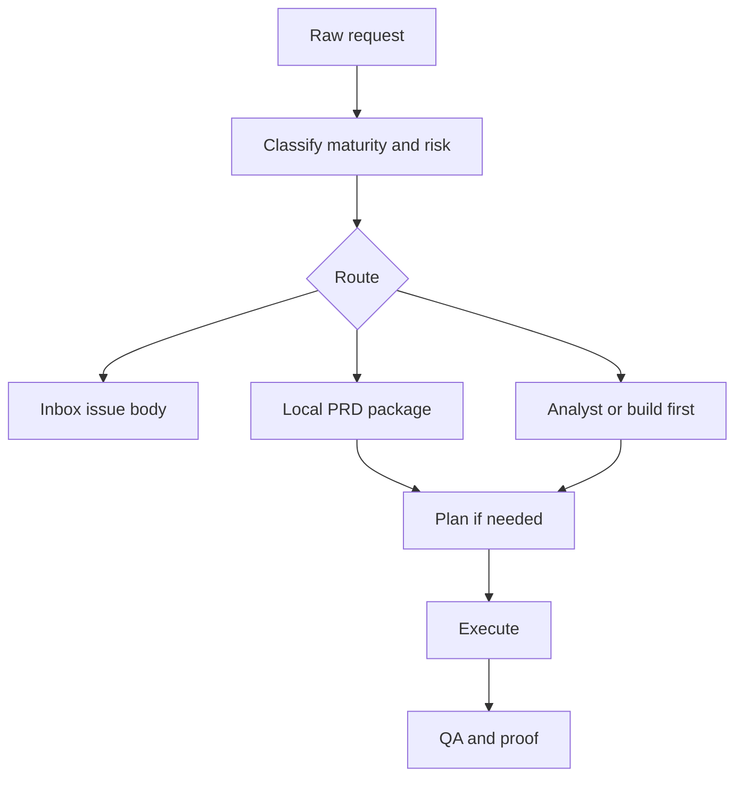

# SPEC: superflow plugin

> Source repository: `nmarcofernandess/superflow`
> Installed plugin name: `superflow`
> Status: marketplace repository for the existing Superflow plugin
> Central decision: publish Superflow as an independent marketplace repo, not as
> a vendored plugin inside product repositories.

---

## 1. Intent

Superflow exists to keep agentic workflow proportional. It classifies maturity,
risk, and user intent before choosing the phase set. The point is not to force a
ritual. The point is to avoid both extremes:

```text
raw idea -> overbuilt analyst/build/plan chain
raw idea -> direct code with no source of truth
```

The correct default is:

```text
request -> classify -> route -> durable artifact -> execute or stop honestly
```

## 2. Decisions

### 2.1 Marketplace root, plugin package inside `plugins/superflow`

The repository root is a marketplace. The plugin package lives in
`plugins/superflow`. This mirrors the `code-flow` repository shape and keeps
consumer repositories clean.

### 2.2 GitHub can be inbox, local specs can be source of truth

Superflow supports both:

- issue-ready PRD bodies for lightweight capture;
- local `specs/NNN-slug/` packages when work is mature enough to execute.

### 2.3 Audit is not classification

`superflow_taskgen.py --classify-only` only routes. Audit/readiness/gap
questions use `superflow_audit.py`, because `gap_count` must come from a gap
model, not from route classification.

### 2.4 Mermaid only

All visual contracts use Mermaid fenced blocks. PlantUML tokens are forbidden by
the validator.

### 2.5 Analyst is a heavyweight phase

Analyst is not a compact PRD checklist. For existing-system work, it must merge
native grill, code recon, implementation mapping, entities/state modeling,
rules/invariants, Mermaid runtime modeling, and blueprint handoff. If evidence
or map is missing, the verdict cannot be `ready`.

## 3. Lifecycle



## 4. Repository Shape

```text
superflow/
├── .agents/plugins/marketplace.json
├── .claude-plugin/marketplace.json
├── plugins/superflow/
│   ├── .codex-plugin/plugin.json
│   ├── .claude-plugin/plugin.json
│   ├── skills/
│   ├── assets/
│   └── scripts/
├── scripts/validate-all.sh
├── README.md
├── SPEC-superflow-plugin.md
└── WARLOG.md
```

## 5. Exported Skills

| Skill | Responsibility |
|---|---|
| `superflow` | Router and phase-budget orchestrator |
| `capture` | GitHub-ready PRD issue capture |
| `taskgen` | Local PRD package creation and issue promotion |
| `analyst` | Product/domain ambiguity before PRD hardening |
| `build` | Technical blueprint/spec for risky work |
| `plan` | Implementation plan from PRD or blueprint |
| `warlog` | Mermaid-first long-running work log |
| `execute` | Implementation from durable Superflow artifacts |
| `qa` | Acceptance and proof closure |
| `audit` | Read-only route/readiness/gap analysis |

## 6. Validation

Required validation before publishing:

```bash
scripts/validate-all.sh
```

The script must run the Superflow validators and smoke tests from the package:

- `validate_superflow.py`;
- `test_superflow_routes.py`;
- `forward_test_superflow.py`.

The validator also protects the Analyst contract: it fails if
`skills/analyst/SKILL.md` loses the required recon/blueprint markers or if
`assets/templates/analysis.md` loses the heavy analysis sections.

Optional runtime validation:

- `claude plugin validate` when Claude Code is installed;
- `codex plugin marketplace list` to verify plugin inventory health.

## 7. Done

This repository is ready when:

- marketplace manifests exist for Codex and Claude Code;
- the plugin package includes Codex and Claude manifests;
- Superflow validators pass;
- route and forward tests pass;
- the repository is public under `nmarcofernandess/superflow`;
- the remote default branch is `main`.
