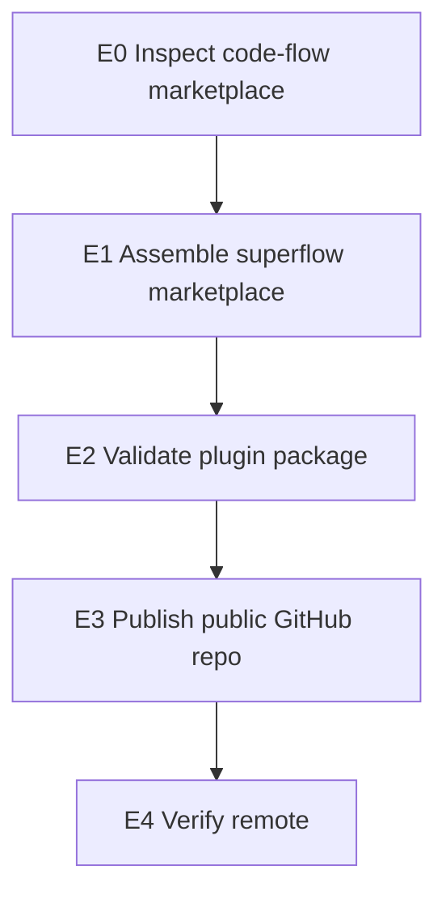

# WARLOG: superflow marketplace

> Goal: publish the existing `superflow` plugin as an independent marketplace
> repository matching the operational shape of `nmarcofernandess/code-flow`.

---

## Dashboard

| Field | Value |
|---|---|
| Project | `superflow` |
| Source repository | `nmarcofernandess/superflow` |
| Plugin target | `superflow` |
| State | Marketplace repo published; PRD/story/status/Build/Plan contract hardened and installed locally |
| Next action | Review diff, commit, and push when ready |

## Mission

Turn Superflow from a personal installed plugin into a shareable marketplace
repository without changing consumer product repos.

## WBS

## Scope

In scope:

- root Codex marketplace manifest;
- root Claude Code marketplace manifest;
- package-level Claude Code manifest;
- MIT license;
- install and update README;
- validation script;
- public repository under `nmarcofernandess`.

Out of scope for this publishing pass:

- changing Superflow routing semantics;
- migrating the current personal install to the new marketplace;
- deleting the existing personal plugin copy.

## Log

### 2026-07-04

- Confirmed `nmarcofernandess/code-flow` is the marketplace style reference.
- Confirmed `superflow@personal` is installed and enabled locally.
- Confirmed `nmarcofernandess/superflow` did not exist before publishing.
- Assembled the standalone marketplace in `/Users/marcoantonio/devkit/superflow`.

### 2026-07-04 - Analyst hardening

- Audited a weak `analysis.md` generated by Superflow against the original
  Supervibe Analyst and the Code Flow analyst/recon/blueprint protocols.
- Root cause: `skills/analyst/SKILL.md` had only a thin section checklist and no
  embedded `analyst-protocol`, `code-recon`, `technical-blueprint`, or output
  template. Build had the same problem at the blueprint boundary.
- Added heavyweight protocols:
  - `assets/references/analyst-protocol.md`
  - `assets/references/code-recon-protocol.md`
  - `assets/references/technical-blueprint-protocol.md`
  - `assets/references/build-protocol.md`
  - `assets/templates/analysis.md`
- Rewrote `skills/analyst/SKILL.md` and `skills/build/SKILL.md` to require
  native grill, evidence matrix, implementation map, entities/state, blueprint
  handoff, Product -> Backend -> Frontend contracts, and ready gates.
- Hardened `validate_superflow.py` so a thin analyst contract fails validation.

### 2026-07-04 - PRD/status/Build/Plan hardening

- Added required PRD sections for `Story de Usuario`, `Story Tecnica`, current
  vs desired behavior, system pattern/contract, acceptance criteria, and
  definition of complete.
- Clarified phase semantics:
  - Build owns `technical_blueprint.md`: architecture, contracts, risk,
    validation, rollback, and dependency sequence.
  - Plan owns `implementation_plan.json`: executable subtasks, file targets,
    verification, acceptance mapping, and owner classification.
  - Execute owns `implementation_log.json`: implementation evidence and
    remaining work.
  - `status.json` stays the GPS for `current_phase`, `decision`, phase state,
    and artifact pointers.
- Removed remaining legacy visual/config wording from runtime texts; Mermaid is
  the only visual contract.
- Synced the updated package to `/Users/marcoantonio/plugins/superflow` and
  installed `superflow@personal` version `0.1.0+codex.20260704210013`.

## Proof Checklist

- [x] `scripts/validate-all.sh` passes for initial publish.
- [x] `plugins/superflow/scripts/validate_superflow.py plugins/superflow --mermaid`
  passes after PRD/status/Build/Plan hardening.
- [x] `plugins/superflow/scripts/test_superflow_routes.py` passes after
  PRD/status/Build/Plan hardening.
- [x] `plugins/superflow/scripts/forward_test_superflow.py` passes after
  PRD/status/Build/Plan hardening.
- [ ] Git repository has a clean committed `main`.
- [ ] GitHub repository exists and is public.
- [ ] Remote `origin` points to `nmarcofernandess/superflow`.
