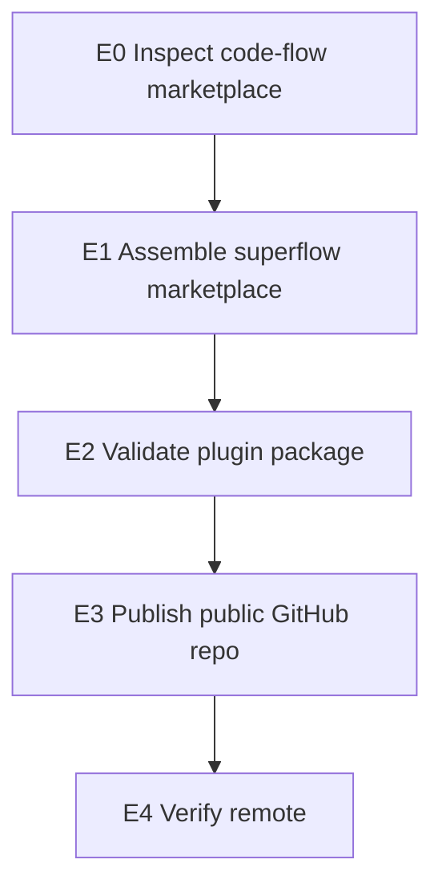

# WARLOG: superflow marketplace

> Goal: publish the existing `superflow` plugin as an independent marketplace
> repository matching the operational shape of `nmarcofernandess/code-flow`.

---

## Dashboard

| Field | Value |
|---|---|
| Project | `superflow` |
| Source repository | `nmarcofernandess/superflow` |
| Plugin target | `superflow` |
| State | Marketplace repo assembled from the validated local Superflow package |
| Next action | Validate, create the public GitHub repository, and push `main` |

## Mission

Turn Superflow from a personal installed plugin into a shareable marketplace
repository without changing consumer product repos.

## WBS

## Scope

In scope:

- root Codex marketplace manifest;
- root Claude Code marketplace manifest;
- package-level Claude Code manifest;
- MIT license;
- install and update README;
- validation script;
- public repository under `nmarcofernandess`.

Out of scope for this publishing pass:

- changing Superflow routing semantics;
- migrating the current personal install to the new marketplace;
- deleting the existing personal plugin copy.

## Log

### 2026-07-04

- Confirmed `nmarcofernandess/code-flow` is the marketplace style reference.
- Confirmed `superflow@personal` is installed and enabled locally.
- Confirmed `nmarcofernandess/superflow` did not exist before publishing.
- Assembled the standalone marketplace in `/Users/marcoantonio/devkit/superflow`.

## Proof Checklist

- [ ] `scripts/validate-all.sh` passes.
- [ ] Git repository has a clean committed `main`.
- [ ] GitHub repository exists and is public.
- [ ] Remote `origin` points to `nmarcofernandess/superflow`.
