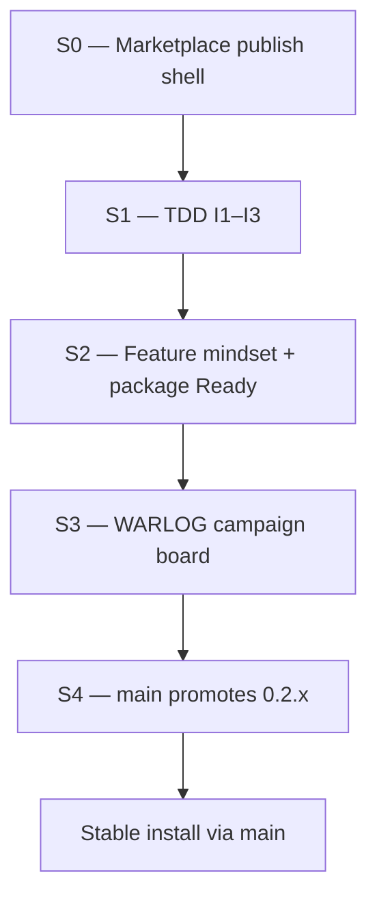

# WARLOG: Superflow marketplace plugin

## Mission

Ship Superflow as a portable Agent Skills marketplace plugin: honest phase routing,
faceted Analyst/Build Ready gates, TDD on code tasks, and a campaign WARLOG that
survives multi-session work without dual skills.

## Scope

- In: plugin contracts, skills, validators, marketplace install (`v0.2.x`)
- Out: status.v2 rewrite, `superflow:proof`, killing `implementation_log`, DietFlow product code

## Campaign map

```mermaid
flowchart TD
  S0["S0 — Marketplace publish shell"] --> S1["S1 — TDD I1–I3"]
  S1 --> S2["S2 — Feature mindset + package Ready"]
  S2 --> S3["S3 — WARLOG campaign board"]
  S3 --> S4["S4 — main promotes 0.2.x"]
  S4 --> Done["Stable install via main"]
```

## Sprints

### S0 — Marketplace publish shell

- State: done
- Depends on: —
- Budget: plan
- Route: Execute → QA
- Human gate: none
- Green contract: public repo + validate-all of the day
- Harness: existing
- Artifacts: README, marketplace manifests
- Next action: —

### S1 — TDD contract I1–I3

- State: done
- Depends on: S0
- Budget: plan
- Route: Plan → Execute → QA
- Human gate: none
- Green contract: `test_tdd_contract.py` green
- Harness: existing
- Artifacts: `tdd-contract.md`, plan/execute/qa skills
- Next action: —

### S2 — Feature mindset + package Ready

- State: done
- Depends on: S1
- Budget: spec
- Route: Analyst → Build → Plan → Execute → QA
- Human gate: none
- Green contract: `test_feature_mindset.py`; exploits A–E fail; Ready gates name `validate_superflow.py`
- Harness: existing
- Artifacts: feature-mindset-contract, reuse-guard, fixtures/mindset
- Next action: —

### S3 — WARLOG campaign board

- State: active
- Depends on: S2
- Budget: plan
- Route: Plan → Execute → QA
- Human gate: none
- Green contract: `test_warlog_contract.py`; diary-only and PlantUML WARLOGs fail; generator shell validates
- Harness: existing
- Artifacts: warlog-contract.md, skills/warlog, fixtures/warlog/campaign
- Next action: finish S3 commit; keep PR open for main

### S4 — main promotes 0.2.x

- State: blocked
- Depends on: S3, human merge of PR
- Budget: direct
- Route: Execute → QA
- Human gate: Marco merges PR to main
- Green contract: `main` plugin.json version ≥ 0.2.1; install without special tag
- Harness: existing
- Artifacts: GitHub PR
- Next action: human merge when ready

## Decisions

- One official WARLOG skill; Warlog Minimal DNA folded in; no PlantUML in plugin
- Package Ready stays on `validate_superflow.py` (Analyst/Build); WARLOG does not replace it
- status.v2 and proof taxonomy stay deferred until campaign board proves useful

## Event Log

- 2026-07-04 | publish | Marketplace shell assembled
- 2026-07-04 | analyst | Analyst/Build protocols hardened
- 2026-07-19 | kernel | Discovery→Analyst, SPEC.md, PRD gathering, task board (memo partial)
- 2026-07-29 | mindset | Feature mindset + package Ready 0.2.0
- 2026-07-29 | warlog | Campaign board contract + skill + gates (S3)

## Risks And Blocks

- `main` still older until PR merge — install pins `v0.2.x` tag
- Old packages with diary-only WARLOG.md will fail package validate until upgraded

## Next Action

- Land S3 on branch; merge S4 only with explicit human approval
