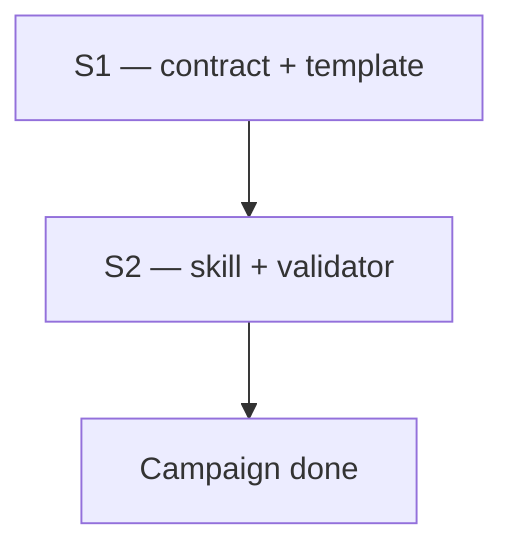

# WARLOG: Campaign board fixture

## Mission

Prove Superflow WARLOG campaign shape with mergeable sprints and green contracts.

## Scope

- In: WARLOG contract, template, skill gates
- Out: status.v2, microtask RFEs

## Context

- Created: 2026-07-29T00:00:00Z
- Route: build_plan_execute
- Phase budget (package): deep

## Campaign map

## Sprints

### S1 — Contract and template

- State: done
- Depends on: —
- Budget: spec
- Route: Build → Plan → Execute → QA
- Human gate: none
- Green contract: validate_superflow accepts campaign WARLOG; fixtures pass
- Harness: existing
- Artifacts: warlog-contract.md, templates/WARLOG.md
- Next action: ship skill rewrite

### S2 — Skill and package gate

- State: active
- Depends on: S1
- Budget: plan
- Route: Plan → Execute → QA
- Human gate: none
- Green contract: test_warlog_contract.py green; plantuml rejected
- Harness: existing
- Artifacts: skills/warlog/SKILL.md
- Next action: run validate-all

## Decisions

- One official WARLOG skill; no parallel warlog-minimal inside plugin
- Mermaid only

## Event Log

- 2026-07-29 | warlog | Fixture campaign board created

## Risks And Blocks

- None for fixture

## Next Action

- Run package validator on this fixture
