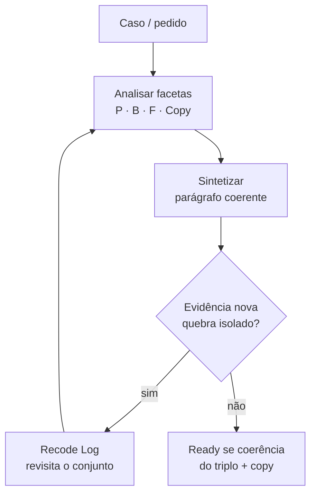

# Feature Mindset Contract

Contrato canônico do Superflow para **Analyst → Build**.  
Portável: não depende de `~/.claude` nem de DietFlow instalado.

## 1. Fatality (vitória)

Analyst e Build só estão prontos quando:

1. **Faceta, não etapa** — Produto, Backend, Frontend e Copy são eixos do mesmo caso.
2. **Síntese, não colagem** — um parágrafo amarra as facetas; três seções soltas = falha.
3. **Recode o conjunto** — evidência nova revisita facetas anteriores; proibido entulho de decisões.
4. **Verdade no terreno** — `path:line` ou `UNPROVEN` explícito; proibido chute confiante.
5. **Procurar, não prescrever** — o plugin manda grepar equivalente no repo; não escolhe shell dogmático.
6. **Prosa só invariante** — strings-safadas; dado mora em estrutura (label, chip, contador).
7. **Ready = coerência** — não “headings preenchidos”.

TDD (`tdd-contract.md`) é fronteira: Analyst/Build **preparam** comportamentos testáveis; **não** substituem RED/GREEN nem inventam comando de teste falso.

## 2. Facetas vs waterfall (Colon em uma tela)

Classificação facetada (Ranganathan / Colon Classification, 1933): isolar **facetas independentes**, **sintetizar** o caso, e quando chega um isolado novo que muda a categoria, **recodificar o conjunto anterior** — não empilhar decisão como entulho arqueológico.

| Waterfall (proibido como processo) | Facetado (obrigatório) |
|---|---|
| Congela Produto → depois Backend → depois Frontend | As quatro facetas coexistem; ordem P→B→F é só **atenção** |
| Decisão append-only | Recode retroativo no log |
| “Preenchi as três seções” = done | Síntese quebra se remover uma faceta |

**Anti-exemplo (freeze linear):**  
“Modal com frase *Continua Retorno por R$ 180 como combinado*” → Backend só tem override de valor → copy e produto **nunca** reabertos → string safada vira “UI final”.

**O que NÃO é:** tratado de biblioteconomia. Uma frase basta: facetas + síntese + recode do conjunto.

## 3. Loop analyze → synthesize → recode

1. **Analyze** — isolar P, B, F, Copy com evidência.
2. **Synthesize** — um parágrafo: promessa + path de dados + composição UI + regra de copy.
3. **Evidence** — arquivo real, payload, grep de reuso, mock.
4. Se a evidência muda um isolado → **Recode Log** e voltar a 1–2 no conjunto.
5. Ready só após coerência (e, em deep/existing-code, ≥1 recode honesta ou prova de que a síntese inicial já casou com o terreno sem contradição — ver proporcionalidade).

## 4. Cada faceta

### Produto (atenção primeiro, sem freeze)

Perguntas: promessa? jornada de menor atrito? superfície (tela/modal/editor/dashboard)? modal = consequência real (não onboarding)? non-goals?

**Evidência mínima:** história de usuário mensurável + non-goals.  
**Fail:** promessa que o Backend marca UNPROVEN sem non-goal; copy de mock tratada como contrato.

### Backend

Perguntas: entidades? action/hook/query? **shape do payload que a tela recebe**? filtros/contagens/estados/permissões que o sistema **realmente** responde?

**Evidência mínima:** `path:line` ou `UNPROVEN`.  
**Fail:** “model existe” sem path de dados; inventar campo que o schema não tem.

### Frontend

Perguntas: existe shell/primitivo/composição no repo? `reuse` | `mode`/`wrapper` | `new`? evidence do grep?

**Evidência mínima:** decisão de reuso com path ou “não há equivalente — gap”.  
**Fail:** `new` sem scan; plugin mandando “use CRUDForDashboard” em todo repo.

### Copy (faceta irmã)

Ver §5. Inventário de toast/empty/modal/banner/helper que a feature toca.

## 5. Strings-safadas (lei portada)

**Crime:** prosa que narra dados de **uma** instância de mockup e finge inteligência de sistema.

**Cinco pecados:**

1. **Prosa-instância** — “Continua Retorno por R$ 180,00, como foi combinado.”
2. **Constante-oráculo** — número de domínio sem fonte (`MINIMO = 0.1`).
3. **Concatenação por extenso** — “…e 2 deles têm gripe” em agregado.
4. **Copy que decide** — julgamento clínico/político no texto em vez de números + decisão humana.
5. **Copy de geometria** — “acima”, “à direita”, “no bloco anterior”.

**Lei:** **PROSA É PARA INVARIANTES. DADO MORA EM ESTRUTURA.**

**Teste do cartesiano (obrigatório para string nova no blueprint):**  
troque 0/1/2/1000, todos os enums, inverta bools, remova opcionais. Se precisa de outra frase à mão para o próximo caso → safada → reescreva.

**Mock ≠ literal:** para cada frase de mock → (a) invariante em messages/constantes, (b) estrutura label+valor/chip/contador, ou (c) morte. Não existe “colar e ajustar depois”.

**Anti-exemplo bom (invariante):** “Atendimentos concluídos não são alterados.”

## 6. Ready gates (binários)

### Analyst ready

Pronto só se:

- existe **Síntese** (não colagem);
- quatro facetas com conteúdo real ou skip_reason proporcional;
- **Recode Log** presente (deep: ≥1 entrada com trigger+facet reescrita; docs-only: `skip_reason` honesto);
- claims técnicos com `path:line` ou `UNPROVEN`;
- reuse decision com evidence quando há UI;
- inventário Copy quando há UI/copy;
- sem string safada como “copy aprovada”.

**Não ready:** headings P/B/F tipograficamente cheios e semanticamente vazios.

### Build ready

Pronto só se:

- **Synthesis** no topo do SPEC;
- contratos P/B/F/Copy;
- tabela **Cross-facet dependencies**;
- Recode Log (herdado + do Build) coerente;
- handoff de comportamentos testáveis **sem** inventar comando de teste;
- coerência: remover qualquer faceta quebra a síntese.

## 7. Proporcionalidade (budget / route)

| Contexto | Imposto |
|---|---|
| `docs` / `docs_only` / copy-only | Copy + Product leves; Backend/Frontend podem `skip_reason`; Recode Log pode ser skip |
| lean / `prd_execute` direto | Síntese curta; path:line se código; 0–1 recode se contradição |
| deep / existing-code / build_plan | Loop completo; Recode Log com entrada real se síntese mudou; reuse scan |

Proibido: forçar ontologia de epico em docs-only (overthinking).  
Proibido: pular path:line em deep “porque o template já tem heading”.

## 8. Anti-padrões (se aparecer → RECODE a seção)

- Waterfall freeze P→B→F como processo.
- Ready por checklist de heading.
- Recode Log fake (“N/A”) em deep sem prova de coerência inicial.
- Symlink para `~/.claude/skills/strings-safadas` (portar a lei).
- Dogma de shell de um monorepo em todo mundo.
- Manifesto sem gate no validator/fixture.
- Nova skill/fase se um gate no protocol resolve (B6).
- Inventar comando TDD no blueprint (D1–D2).

## IDs de coverage (auditoria)

F1–F7, T1–T7, S1–S6, B1–B6, H1–H4, D1–D2 — ver `assets/fixtures/mindset/coverage.json`.
