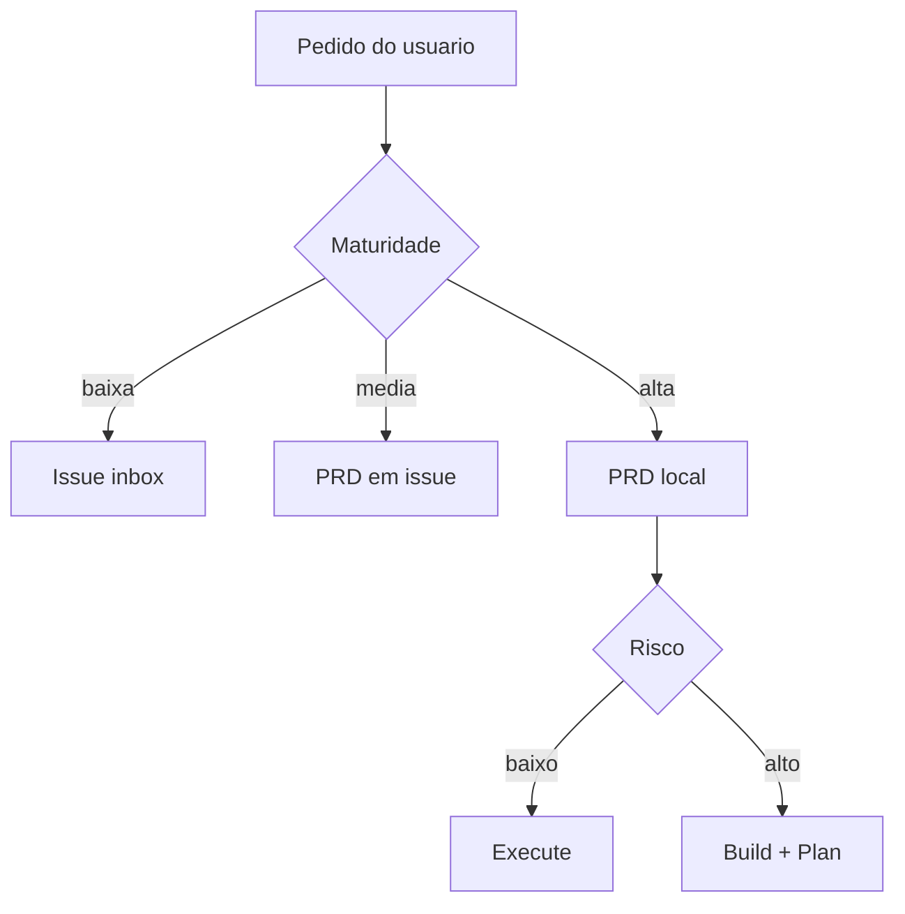
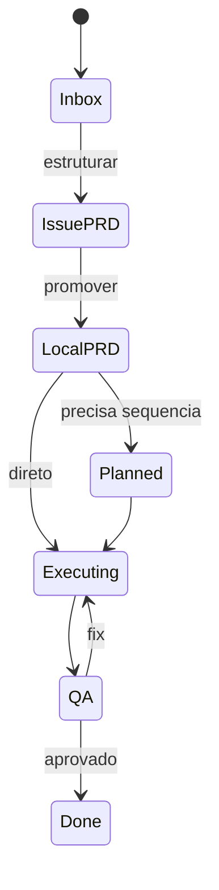

# Mermaid Contract

Superflow usa Mermaid como linguagem visual nativa. Diagramas ficam dentro do
Markdown em fenced blocks e devem ser legiveis sem gerar imagem externa.

## Tipos permitidos

| Tipo | Uso |
|------|-----|
| `flowchart` | Pipeline, decisao, dependencia |
| `stateDiagram-v2` | Estado de issue, PRD, spec e execucao |
| `sequenceDiagram` | Interacao entre usuario, GitHub, taskgen e executor |
| `erDiagram` | Entidades persistidas e relacoes |
| `mindmap` | Decomposicao conceitual |
| `journey` | Jornada do usuario ou operador |
| `quadrantChart` | Decisao por risco/incerteza |
| `timeline` | Roadmap ou historia de decisao |
| `gantt` | Sprint ou sequencia com datas reais |
| `requirementDiagram` | Rastreabilidade entre DoD, criterio e prova |

## Regras

1. Todo diagrama deve ter titulo implicito pelo heading anterior.
2. Labels com espaco, acento ou pontuacao usam aspas.
3. Diagrama deve carregar em preview Markdown sem asset externo.
4. Quando o diagrama for contrato tecnico, validar com Mermaid CLI.
5. Nao duplicar o mesmo conteudo em texto e diagrama; o texto explica decisao,
   o diagrama mostra estrutura.
6. WARLOG, build e plan usam Mermaid quando houver estado, dependencia,
   sequencia ou rastreabilidade visual relevante.

## Exemplo de roteamento



## Exemplo de ciclo de vida



## Validacao opcional

```bash
npx -y @mermaid-js/mermaid-cli --version
npx -y @mermaid-js/mermaid-cli -i diagram.mmd -o diagram.svg
```
