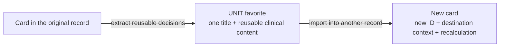

# PRD Contract

The PRD is the source of truth for a Superflow task. It can live in a GitHub
issue or in `specs/NNN-slug/PRD.md`. The layout stays the same; the maturity and
confidence fields say how ready it is.

The PRD is written for two readers: the people who need to understand the
product problem and the people who will implement it. The short explanation at
the top must serve the first reader without replacing the precise contract
below.

## Required Sections

```md
# PRD: <title>

## TL;DR

<standalone causal explanation written after the full PRD has been drafted and reread>

## State

- Source:
- Confidence:
- Route:
- Phase budget:
- Execution strategy:
- Created:

## Problem

## Goal

## Users / Actors

## Story de Usuario

## Story Tecnica

## Scope

### In Scope

### Out of Scope

## Expected Behavior

## Current Behavior / Bug

## Desired Behavior

## System Pattern / Contract

## Acceptance Criteria

- [ ] ...

## Definition of Complete

- [ ] ...

## Technical Context

## Data / Contracts

## UX / States

## Risks

## Open Questions

## Next Phase
```

## TL;DR rule

`## TL;DR` is the first section after the title and the last PRD section to be
written. It is **causal compression**, not a shorter pile of abstractions. Cut
reading volume; do not cut the links that let the reader understand why the
problem exists.

This contract combines established practices instead of inventing a new prose
method: plain language, situation-complication-answer organization, important
information first, concrete examples, and paraphrase testing. The operational
rule is simple: a reader should not have to reconstruct the missing explanation
inside their head.

### Pass 1 — build the causal map

Finish and reread the complete PRD. Before drafting the TL;DR, answer these
questions in scratch. They are a thinking tool, not required headings in the
final text:

1. What can the user already do, in familiar product language?
2. Which objects or cases exist? If two cases legitimately behave differently,
   what makes them different?
3. What does the system do today, and what model or rule makes it do that?
4. Why is that behavior wrong here? If the same behavior is correct elsewhere,
   explain the boundary.
5. What concrete example exposes the mismatch?
6. What does the user observe or risk because of it?
7. What will the change preserve, discard, recreate, or prevent — and why?
8. What remains deliberately outside this PRD?

Not every PRD needs every answer. Every causal link needed to understand this
PRD does. If a required answer is unknown, keep the PRD in `gathering`; do not
hide the gap with polished language.

### Pass 2 — write the standalone explanation

Turn the causal map into a natural explanation, usually in this order:

```text
familiar situation
→ concrete current mechanism
→ mismatch and reason
→ observable consequence
→ proposed behavior
→ scope boundary
```

Introduce the object before its internals. When categories matter, contrast
them before describing the bug. Prefer one concrete example before the general
conclusion. Technical names may follow the plain explanation when they help the
implementation reader; they must not replace it.

There is no hard word limit. The TL;DR is the shortest version that preserves
the complete causal chain. Three clear paragraphs are better than one cryptic
paragraph; one clear paragraph is better than five repetitive ones.

### Inference-debt test

Vague compression fails even when every word is familiar. Rewrite claims such
as:

| Vague claim | What the TL;DR must make explicit |
|---|---|
| "the name is stored twice" | The two storage or UI locations, why both exist, and why they represent one concept here. |
| "it carries leftovers/context" | Which fields or state travel, why they were valid at the source, and why they do not belong at the destination. |
| "the content can change" | What changes, during which action, and which stale or conflicting value causes it. |
| "the new model is clean/pure" | What is preserved, what is omitted, and what the destination recreates. |
| "behavior is inconsistent" | Which two user-visible paths produce different results. |

Delete vague nouns or unpack them. Examples such as identifiers, derived
calculations, and editor flags are still incomplete unless the text says
whether they should travel and why. A reasonable reader who can ask “but isn't
that desired?” has found a missing causal link.

### Reasonable-objection and paraphrase gates

Read the TL;DR by itself. Challenge every important claim with `why?`, `where?`,
`what exactly?`, `isn't that intentional?`, and `what happens instead?`. Answer
predictable objections in the text; do not outsource them to the PRD body.

Then apply the closed-book paraphrase test. After one reading, an outsider must
be able to explain:

- what the user is doing;
- which objects or cases matter;
- what is wrong today and why;
- one concrete example;
- what consequence follows;
- what will change and what will not.

If the reader needs to reread the PRD, invent a bridge, or asks “como assim?”,
the TL;DR is not ready.

### Visuals

An ASCII sketch or Mermaid diagram may follow the prose when it removes real
inference work. Use ASCII for a small contrast or mapping; use Mermaid for a
journey, branch, lifecycle, or dependency. The visual supports the explanation;
it never replaces the missing sentence. Mermaid follows
`references/mermaid-contract.md`.

Do not draw the same relationship twice. Choose the smallest visual that makes
the invisible mechanism visible.

### Worked example — vague versus causal

This summary is too compressed:

> Some favorites store the name twice and carry leftovers from the original
> screen. This can make the content change when it is reopened or imported. The
> new model creates clean templates.

It leaves the reader to discover what “twice,” “leftovers,” “change,” and
“clean” mean. A causal version explains the object first:

> DietFlow lets a nutritionist save either a complete composition or one
> isolated clinical piece for reuse. A complete composition needs a general
> name and may contain several cards with names of their own. An isolated piece
> is one object and should have one name.
>
> Today both kinds use a data shape designed for complete records. An isolated
> favorite therefore receives one name in the favorite header and another
> inside its card. It can also copy identifiers, already-derived calculations,
> and editor settings tied to the record where that card was created. Those
> values must not travel: each import creates a new occurrence, with a new
> identity, destination context, and recalculated values. The clinical choices
> made by the nutritionist are the part that must survive.
>
> The change gives each module's isolated favorite a portable contract for both
> saving and importing. Saving extracts one title and the clinical fields worth
> reusing. Opening or importing rebuilds a card for the new context. In the
> favorites editor, the header owns the only title and the card hides actions
> that require a multi-card composition. The work does not redesign complete
> compositions or the global delete/merge lifecycle.

A compact ASCII contrast can make the classification visible:

```text
COMPLETE (composition) = composition title + several independently named cards
UNIT (one piece)       = one reusable card    + one identity
```

Or, when the transformation matters more than the classification:



The example is intentionally longer than the vague version. It removes the
reader's work instead of merely removing words.

### Truth and state

The TL;DR must not introduce a decision, promise, or scope boundary absent from
the body. If the causal pass exposes a contradiction, fix the body first and
regenerate the TL;DR.

A scaffold in `gathering` may contain an explicit placeholder in this section.
Before the PRD is promoted to `ready`, the placeholder must be replaced by a
real summary. The validator checks placement and rejects placeholders. Semantic
quality remains the responsibility of the skill and the human review; a word
counter cannot prove understanding.

## Confidence

| Confidence | Meaning | Allowed next step |
|------------|---------|-------------------|
| `low` | Useful capture, missing core facts | inbox, analyst, ask |
| `medium` | Implementable after plan/build | plan, build, analyst |
| `high` | Ready for direct execution or plan | execute, plan |

## PRD States

`decision.prd_status` in `status.json` tracks the deliverable state of the
PRD itself:

| State | Meaning |
|---|---|
| `gathering` | Still collecting decisions/evidence. Every scaffold is born here. |
| `ready` | Fulfills this contract and can feed the next phase. |
| `blocked` | Depends on an external decision or missing evidence. |
| `superseded` | Another version/artifact is canonical now. |

Promotion `gathering -> ready` is an act of the skill that wrote or reviewed
the PRD content against this contract — never of a script or keyword score. A
structurally complete file that is semantically empty ("To be filled...")
stays `gathering`. Legacy specs may contain `draft`/`complete`/`discarded`;
read them as `gathering`/`ready`/`superseded` (lazy migration).

## Acceptance Criteria Rules

- Criteria must be observable.
- Criteria must avoid "works well" language.
- Each criterion should be individually checkable.
- Include at least one regression/non-goal criterion for changes near existing
  behavior.

## Visual Usage

Use Mermaid only when it reduces ambiguity. Prefer:

- `flowchart` for phase and user flow.
- `stateDiagram-v2` for lifecycle/status.
- `sequenceDiagram` for tool/system interaction.
- `erDiagram` for data shape.

Do not include decorative diagrams.

The narrow TL;DR exception is a small ASCII sketch for a contrast or mapping
that is clearer as text. Other PRD diagrams remain Mermaid.

## Local PRD Package

```txt
specs/NNN-slug/
├── PRD.md
├── status.json
└── progress.md
```

Optional artifacts:

```txt
analysis.md
ANALYSIS-*.md
SPEC.md
technical_blueprint.md   (legacy name for SPEC.md)
implementation_plan.json
implementation_plan.md
implementation_log.json
qa_report.md
units/*/PRD.md
```

## Story Rules

- `Story de Usuario` states who needs the outcome, what changes for them, and
  why it matters.
- `Story Tecnica` states the system obligation that makes the user story true:
  source of truth, contract, state, or integration expectation.
- `Current Behavior / Bug` can say "Not proven yet" for new work, but existing
  bug or gap claims need evidence before execution.
- `System Pattern / Contract` names the local pattern to preserve or says what
  the next phase must prove.
- `Definition of Complete` is broader than acceptance criteria: it includes
  artifact/status updates and proof closure.
