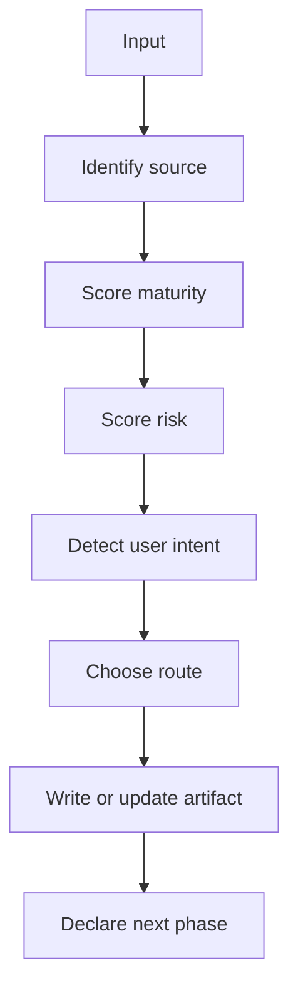
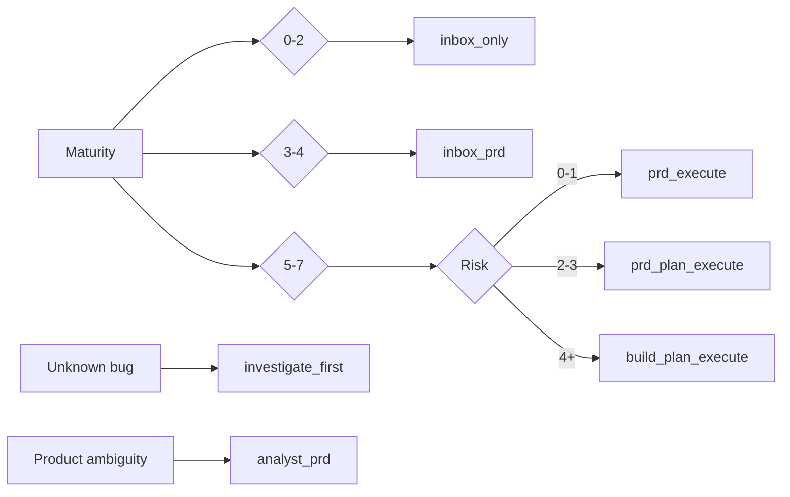

# Routing Protocol

Superflow routes by maturity and risk. The question is not "which ritual comes
next?". The question is "what is the cheapest phase set that can make this work
durable, correct, and verifiable?".

## Decision Model

## Source

| Source | Evidence |
|--------|----------|
| `inline` | User message only |
| `file` | Path to PRD/spec/doc |
| `github_issue` | Issue URL/number/body |
| `spec_folder` | Existing `specs/NNN-*` |
| `diff` | Current working tree |

Always inspect the source before routing. Do not route from memory when a file,
issue, or folder exists.

## Maturity Score

Start at 0. Add one point for each proven item:

- Concrete outcome is stated.
- User or actor is clear.
- Target surface/module/repo is clear.
- Acceptance criteria are testable.
- Non-goals or constraints are named.
- Data/API/files involved are named or discoverable.
- Failure mode or QA gate is named.

| Score | Meaning |
|-------|---------|
| 0-2 | Braindump |
| 3-4 | Structured idea |
| 5-6 | PRD candidate |
| 7 | Execution-ready PRD |

## Risk Score

Start at 0. Add one point for each condition:

- Database/schema/migration/data migration.
- Auth, billing, permissions, security, privacy.
- Cross-module or shared primitive change.
- Async jobs, queues, external APIs, flaky runtime.
- Large UI behavior with many states.
- Bug with unknown cause.
- Performance, concurrency, race, or cache semantics.
- Existing tests are weak or absent around touched behavior.

| Score | Meaning |
|-------|---------|
| 0-1 | Low |
| 2-3 | Medium |
| 4+ | High |

## Route Selection

Override with explicit user intent:

- "so registra", "joga no GitHub", "inbox" -> `inbox_only` or `inbox_prd`.
- "taskgen local", "cria spec", "vira pasta" -> at least `local_prd`.
- "executa direto", "implementa isso" with mature input -> `prd_execute`.
- "pensa", "analisa", "analyst" -> `analyst_prd`.
- "arquitetura", "build", "risco tecnico" -> `build_plan_execute`.
- "bug", "descobre", "investiga" -> `investigate_first`.

## Phase Budget Selection

| Conditions | Phase budget |
|------------|--------------|
| Maturity <= 2 and no execution intent | `capture` |
| Maturity >= 5 and risk <= 1 | `lean` |
| Maturity >= 5 and risk 2-3 | `standard` |
| Product ambiguity or risk >= 4 | `deep` |
| Unknown bug, migration, security, data correctness | `forensic` |

## Stop Rules

- Do not execute a `confidence=low` PRD without explicit user approval or one
  improvement pass.
- Do not run build/plan just to satisfy ritual when the direct path is clear.
- Do not open GitHub issue if the user asked for local-only work.
- Do not create local folders for pure inbox capture unless the user explicitly
  asks for local archival.
