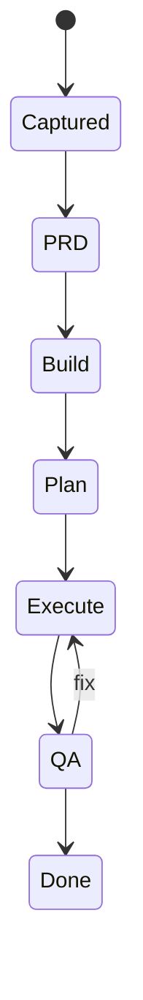
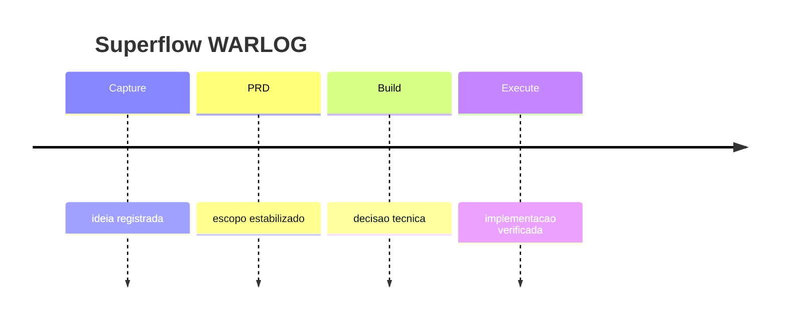

# WARLOG Contract

WARLOG e o log vivo de produto, plugin, epico ou investigacao longa. Ele nao
substitui `progress.md` de uma task local pequena. Use WARLOG quando a historia
precisa sobreviver a varias sessoes, branches, issues ou decisoes.

## Quando criar

Crie ou atualize `WARLOG.md` quando:

- `phase_budget = deep` ou `forensic`.
- O trabalho atravessa mais de uma sessao.
- Existem decisoes que precisam ser rastreadas.
- O pedido envolve plugin, workflow, arquitetura, migracao ou epico.
- O usuario pede warlog, timeline, status vivo ou trilha de decisao.

Nao crie WARLOG para tarefa lean obvia. Use `progress.md`.

## Mermaid

WARLOG usa Mermaid como primeira linguagem visual. Markdown narrativo continua
canonico, mas os snapshots visuais devem ser fenced blocks `mermaid`.

Use estes tipos:

| Visao | Mermaid |
|-------|---------|
| Estado atual | `stateDiagram-v2` |
| Linha do tempo | `timeline` |
| Dependencias | `flowchart TD` |
| Sprint com datas reais | `gantt` |
| Prova de DoD | `requirementDiagram` |

Nao use sintaxe visual legada. Nao use imagem gerada como fonte canonica.

## Estrutura

1. Contexto e objetivo.
2. Snapshot visual em Mermaid.
3. Decisoes tomadas.
4. Evento logado com data, fase e evidencia.
5. Riscos, bloqueios e proxima acao.

## Snapshot padrao

## Linha do tempo padrao

## Regras

- Atualize `status.json.artifacts.warlog = "WARLOG.md"` quando o WARLOG existir.
- WARLOG pode resumir tasks, mas nao substitui `implementation_plan.json` nem
  `implementation_log.json`.
- Registre skipped phases no WARLOG quando a decisao for importante para uma
  leitura futura.
- Se o WARLOG contradiz o PRD, pare e resolva a fonte de verdade antes de
  executar.
- Diagrama grande demais vira ruido. Divida em snapshots pequenos.
