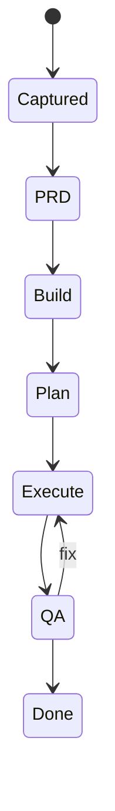
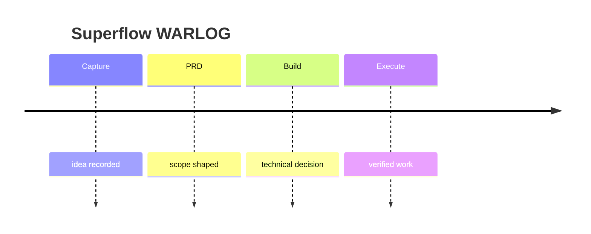

# WARLOG: {title}

## Context

- Created: {created_at}
- Route: {route}
- Phase budget: {phase_budget}
- Confidence: {confidence}
- Source: {source}

## State Snapshot

## Timeline

## Decisions

- Initial route: {route}
- Initial next phase: {next_phase}

## Event Log

- {created_at} | taskgen | Created WARLOG shell.

## Risks And Blocks

- {risks}

## Next Action

- {next_phase}
