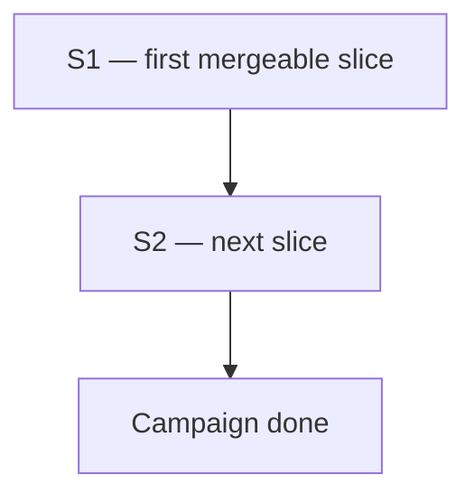

# WARLOG: {title}

## Mission

{mission}

## Scope

- In: {scope_in}
- Out: {scope_out}

## Context

- Created: {created_at}
- Route: {route}
- Phase budget (package): {phase_budget}
- Confidence: {confidence}
- Source: {source}

## Campaign map

```mermaid
flowchart TD
  S1["S1 — first mergeable slice"] --> S2["S2 — next slice"]
  S2 --> Done["Campaign done"]
```

## Sprints

### S1 — {first_sprint_title}

- State: ready
- Depends on: —
- Budget: {sprint_budget}
- Route: {route} → Execute → QA (trim phases that do not apply)
- Human gate: none
- Green contract: package validator green; acceptance criteria from PRD
- Harness: existing
- Artifacts: PRD.md, status.json
- Next action: {next_phase}

## Decisions

- Initial route: {route}
- Initial package phase budget: {phase_budget}

## Event Log

- {created_at} | warlog | Created campaign WARLOG shell.

## Risks And Blocks

- {risks}

## Next Action

- {next_phase}
