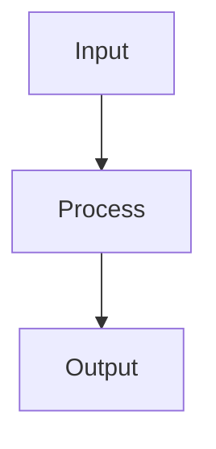

# Analyst: {title}

## State

- Source: {source}
- Route: {route}
- Phase budget: {phase_budget}
- Confidence: {confidence}
- Created: {created_at}
- Verdict: pending

## TL;DR

Write the conclusion in 2-4 direct sentences. Include whether this is ready for
taskgen, ready for build, needs recon, needs human decision, or must split.

## Phase 0 Grill

| Signal | Verdict | Notes |
|---|---|---|
| Action clear |  |  |
| Persona clear |  |  |
| Input/output clear |  |  |
| Scope clear |  |  |
| Objective criteria clear |  |  |

## Source And Scope

- Input source:
- In scope:
- Out of scope:
- Assumptions:

## Product Promise

Who needs what outcome, what is broken today, and what success looks like.

## Current Terrain

Facts from the current system. Existing-code claims require evidence.

## Evidence Matrix

| Path | Lines | Fact | Confidence |
|---|---:|---|---|
| `UNPROVEN` | - | Replace with source-backed evidence before ready verdict. | low |

## Implementation Map

| Area | Path | Role | Decision |
|---|---|---|---|
| Context / entry | `UNPROVEN` |  | unknown |
| Backend contracts | `UNPROVEN` |  | unknown |
| Services / hooks / state | `UNPROVEN` |  | unknown |
| Shells / shared primitives | `UNPROVEN` |  | unknown |
| Frontend composition | `UNPROVEN` |  | unknown |
| Tests / proof | `UNPROVEN` |  | unknown |

## Entities And State

```text
ENTITY: <Name>
- Attributes:
- Actions:
- Relations:
- Source of truth:
- Runtime states:
- Invalid states to prevent:
```

## Runtime / Data Flow



## Rules And Invariants

- MUST:
- MUST NOT:
- IF / THEN:
- Edge cases:

## Architecture Risks

| Severity | Risk | Evidence | Fix direction |
|---|---|---|---|

## Blueprint Handoff

| Path/Area | Action | Reason | Validation |
|---|---|---|---|

## Acceptance Criteria

- [ ] Criteria with verification path.

## Open Questions

- None, or precise decisions Marco must make.

## Grill Verdict

- Verdict:
- Why:
- Next stage:

## Recommended Next Phase

State the next Superflow phase and why.
