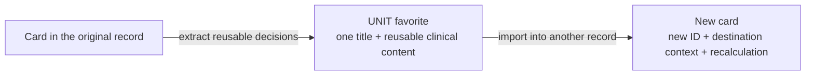

# Explain Clearly

Use this skill when the problem is not ugly prose but missing understanding.
Semantic reconstruction comes before prose.
The source artifact is evidence of what somebody wrote. It is not automatically
evidence that the writer understood the product, separated current truth from a
decision, or explained the right causal chain.

This skill owns **meaning reconstruction**. After the meaning is sound,
`writing-clearly-and-concisely` may improve sentence-level expression. If the
deliverable is visual HTML, `html-didatico` owns presentation, dioramas, and
wireframes after this skill has made the story true and teachable.

## Core Law

> Do not simplify the existing words. Reconstruct the subject, then explain it
> again in your own words.

Code truth and source documents determine facts, constraints, risks, and costs.
They do not determine product intent by themselves. A component that exists is
proof of current implementation and possible reuse, not proof that its UX is
correct.

## When to Use

Use this skill for:

- a PRD TL;DR;
- a spec or Analyst section that is accurate but cognitively opaque;
- a technical explanation for a product, operations, or non-specialist reader;
- a status wall or roadmap item that mixes outcome with implementation jargon;
- an existing HTML whose layout may be good but whose story is wrong or thin;
- a request to make something "simple", "human", "understandable", or
  explainable without a translator.

Do not use it for pure proofreading, grammar, tone, or shortening after the
meaning is already settled. Use `writing-clearly-and-concisely` for that.

## Modes

Choose the smallest mode that satisfies the request:

1. **Explain** — reconstruct the meaning and answer in prose. Do not edit files
   unless asked.
2. **Rewrite** — replace the explanation in a named artifact. Preserve the
   surrounding medium and correct visual structures unless the user authorized
   a redesign or they encode the wrong model.
3. **TL;DR** — produce the shortest standalone explanation that preserves the
   causal chain. There is no hard word limit.

This is a standalone skill. It is not a Superflow phase and does not create or
update `status.json`.

## Procedure

### 1. Read the target completely

Read the whole artifact before changing it. A bad paragraph may depend on a
definition, diagram, decision, or contradiction elsewhere in the same file.

When the artifact cites code, a canonical document, a decision record, or a
completed implementation, inspect the relevant source far enough to establish
the meaning. Follow cited evidence; do not launch an unbounded repository audit
just to make the explanation sound authoritative.

Treat every material claim as one of:

| State | Meaning |
|---|---|
| `CONFIRMED` | Supported by current source evidence. |
| `DECISION` | Chosen product or architecture direction, not current behavior. |
| `IN_FLIGHT` | Dispatched or being implemented, not landed truth. |
| `INFERENCE` | Best interpretation of evidence, explicitly identified. |
| `UNKNOWN` | Required meaning is absent or contradictory. |

Never silently convert `IN_FLIGHT`, `INFERENCE`, or `UNKNOWN` into fact. If an
unknown is essential to the explanation, investigate within scope or expose the
gap. Polished invention is still invention.

### 2. Build a semantic ledger in scratch

Before writing prose, inventory the claims that matter:

```text
claim
→ kind: current fact | product decision | target | status | non-goal
→ evidence
→ confidence
→ consequence for the reader or user
```

The ledger is scratch unless the user asks to see it. Its purpose is to stop an
artifact from blending:

- what exists today;
- why it exists;
- what is broken;
- what was decided;
- what is merely being implemented;
- what remains outside the work.

### 3. Reconstruct the object and case model

Name the thing before naming its internals. Ask:

1. What object does the user think they are handling?
2. Which distinct cases exist, and why are they genuinely different?
3. Who owns each concept at the source and at the destination?
4. Which data is a reusable user decision?
5. Which data is valid only in the original screen, record, or lifecycle?
6. What must be preserved, discarded, recreated, or recalculated?
7. Which differences are domain necessities, and which are implementation
   accidents?

If the explanation says two things are "the same" or "different", state the
axis. Identity, display name, payload, lifecycle, metrics, dependencies, and UI
location are different axes until proven otherwise.

### 4. Build the causal chain

Arrange the meaning before polishing it:

```text
familiar situation
→ concrete current mechanism
→ mismatch and why it is a mismatch here
→ observable consequence
→ target behavior
→ scope boundary
```

Not every explanation needs six paragraphs. Every necessary link must appear
somewhere. If the current mechanism is correct in another case, contrast the
cases before calling it a bug.

Prefer one concrete example before the general rule. The example must be
supported by the source or labeled hypothetical.

### 5. Pay inference debt

Familiar words can still hide the entire explanation:

| Vague claim | Debt that must be paid |
|---|---|
| "the name is stored twice" | Where the two values live, why both locations exist, and why they represent one concept in this case. |
| "it carries leftovers/context" | Which values travel, why they were valid at the source, and why they must not travel to the destination. |
| "the content can change" | What changes, during which action, and which stale or competing value causes it. |
| "the new model is clean/pure" | What is preserved, omitted, recreated, and recalculated. |
| "the behavior is inconsistent" | Which user-visible paths produce which different results. |
| "the system now handles identity" | Which actor owns the name, when it is committed, and what happens on conflict. |

Identifiers, calculations, flags, snapshots, and context are not explanations
by themselves. Say what they do and whether that behavior is desired.

### 6. Rewrite from the semantic model

Close the source and write the explanation from the reconstructed model. Do not
walk sentence by sentence replacing technical nouns with softer nouns. That is
lexical laundering: the ambiguity survives with prettier words.

Use this order when it helps:

- concrete object and user action;
- meaningful case distinction;
- current mechanism;
- one example;
- consequence;
- target rule;
- non-goal or boundary.

Technical names may follow the plain explanation when they help a specialist.
They must not carry the explanation alone.

### 7. Run the gates

#### Reasonable-objection gate

Challenge each material sentence:

- Why?
- Where exactly?
- What changes?
- Isn't that behavior intentional?
- Why should that datum not travel?
- What happens instead?
- Is this landed, decided, or merely proposed?

If a predictable objection has a real answer, put enough of that answer in the
text. Do not make the reader excavate another document for the central bridge.

#### Closed-book paraphrase gate

After one reading, an outsider should be able to retell:

- what the user is doing;
- which objects or cases matter;
- what the system does today and why;
- what goes wrong in one concrete example;
- what changes;
- what deliberately does not change.

If the retelling depends on invented links or produces "como assim?", the
explanation is not ready.

#### Truth gate

Reopen the sources. Verify that the rewrite did not turn a candidate into a
decision, a dispatched change into current truth, or an example into a
universal rule.

## Relationship to Visual Artifacts

Meaning and presentation are separate layers:

```text
source evidence
→ explain-clearly: semantic model and causal story
→ writing-clearly-and-concisely: sentence-level editing
→ html-didatico: layout, dioramas, wireframes, and visual hierarchy
```

For an existing HTML, preserve useful dioramas, wireframes, and navigation.
Rewrite labels and scenes only when they encode the wrong semantic model. A
visual can expose a relationship; it cannot replace the sentence that explains
why the relationship matters.

Use a small ASCII sketch for a compact classification or mapping. Use Mermaid
for a journey, branch, lifecycle, or dependency. Follow
`../../assets/references/mermaid-contract.md`. Do not draw the same relationship
twice.

## Worked Example: UNIT Favorites

This version sounds simple but leaves the problem inside the reader's head:

> Some favorites store the name twice and carry leftovers from the original
> screen. This can make the content change when reopened or imported. The new
> model creates clean templates.

The missing model is that the product stores two kinds of reusable object:

```text
COMPLETE = one composition title + several independently named cards
UNIT     = one reusable card       + one identity
```

A causal explanation can then say:

> DietFlow lets a nutritionist save either a complete composition or one
> isolated clinical piece for reuse. A complete composition needs a general
> name and may contain several cards with names of their own. An isolated piece
> is one object and should have one name.
>
> Today both kinds use a data shape designed for complete records. An isolated
> favorite therefore receives one name in the favorite header and another
> inside its card. It can also copy identifiers, already-derived calculations,
> and editor settings tied to the record where that card was created. Those
> values are useful in the original record but must not travel: each import
> creates a new occurrence, with a new identity, destination context, and
> recalculated values. The nutritionist's clinical choices are what must
> survive.
>
> The change gives each module's isolated favorite a portable contract for
> saving and importing. Saving extracts one title and the clinical fields worth
> reusing. Opening or importing rebuilds a card for the new context. In the
> favorites editor, the header owns the only title and the card hides actions
> that require a multi-card composition. This work does not redesign complete
> compositions or the global delete and merge lifecycle.

The explanation is longer than the vague version because it removes inference
work rather than merely removing words.

The same transformation can be shown when the movement matters:



## Output Contract

Do not force a ritual report onto a simple rewrite. The final artifact must,
however, satisfy these properties:

- it is faithful to source evidence and labels unresolved status honestly;
- it teaches the object model before relying on internal names;
- it contains the necessary causal links;
- it names concrete values and user-visible consequences;
- it distinguishes current truth, decision, in-flight work, and non-goals;
- it can be paraphrased after one reading;
- it uses no more structure than the reader needs.
